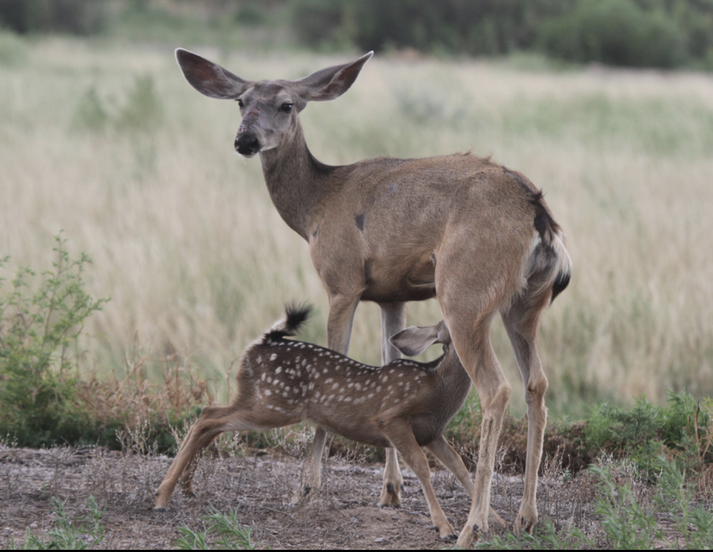
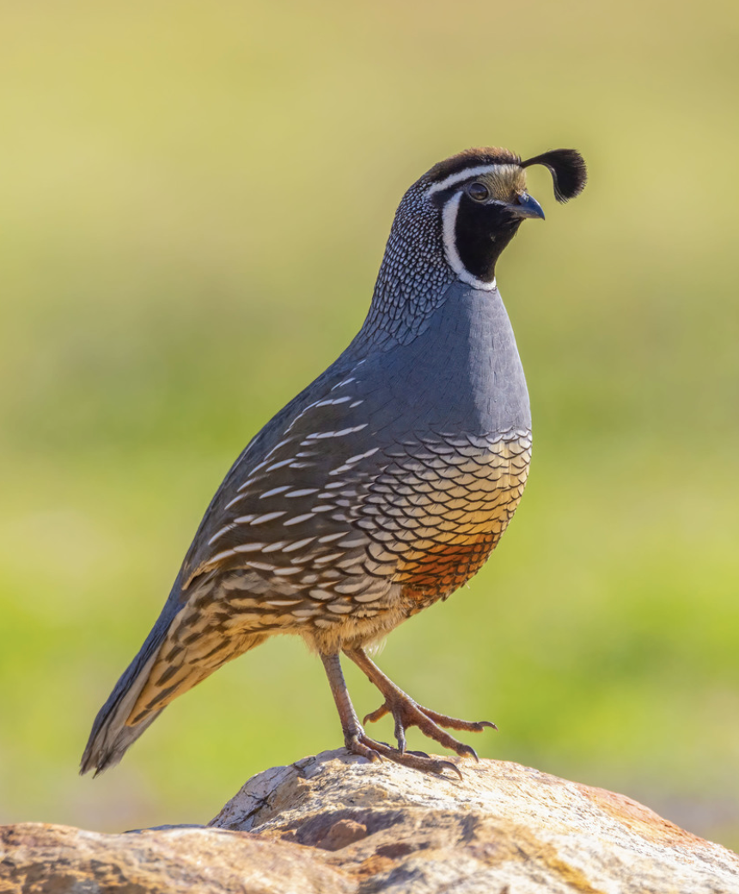
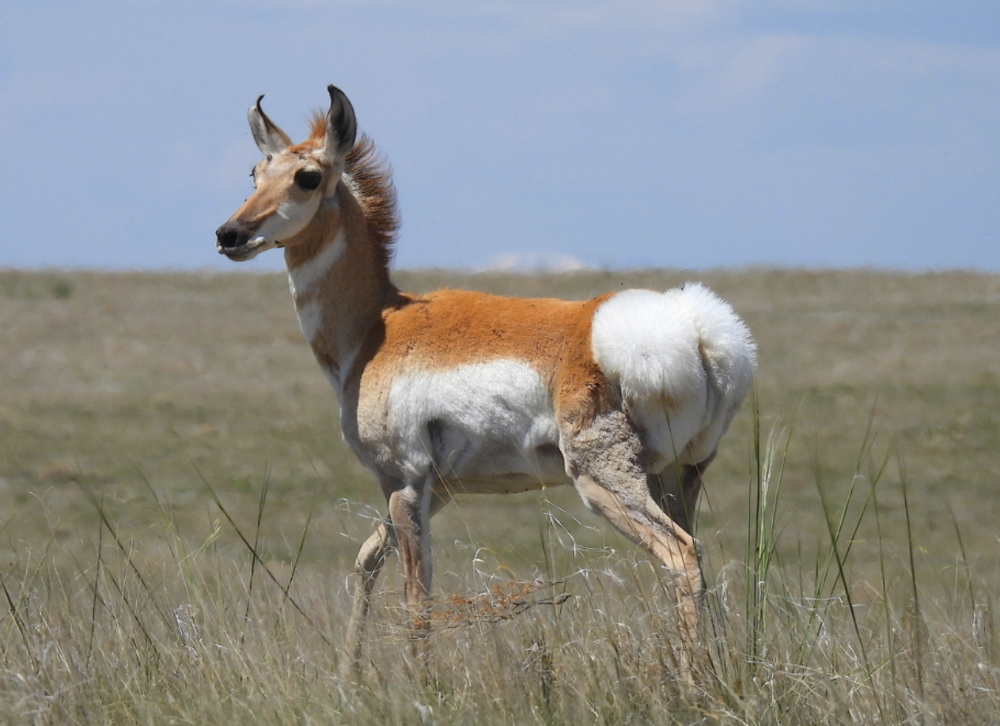

```{r setup, include=FALSE}
knitr::opts_chunk$set(
	echo = TRUE,
	message = FALSE,
	warning = FALSE,
	cache = TRUE
)
```

## Exercise 3 -- Analysis of Categorical Data

## Problems

**[Dataset 1](exercise_3_dataset1.csv)** -- For this dataset, you are conducting an experiment to see if there is a difference in deer density (Y; deer/ha) between predator exclusion plots and control plots (X; groups). Technically, this could be analyzed with a 't-test'. However, for consistency with our general approach toward statistics, please use the 'lm()' function to do the analysis -- not the 't.test()' function. Report your results using the standard sentence for reporting results with categorical X-data:

**"We found that [group 1] [was/were] [$\beta_1$] [Y-units] ([+/-CI]; +/-95% CI) [descriptor word] in [Y-variable] than [group 2] (p = [p-value])."**

***if p > 0.05, then add: "; however, our results were not statistically significant."**

{width=50%}

Picture: James Stewart

**[Dataset 2](exercise_3_dataset2.csv)** -- For this dataset, you are conducting an experiment to see if the density of California quail (*Callipepla californica*) (Y; quail/hectare) varies among four habitat types (X): open pine, closed pine, sagebrush, and agriculture. Answer the following questions:

1. Run an Analysis of Variance (ANOVA) in R. Write a sentence describing the results (i.e., p-value). Typically, this sentence is something like "**ANOVA indicated that at least two of the [x-variable] were significantly different from each other (p = [p-value]).**"

2. Plot the relationship between quail density and habitat types in R and paste the graph in your Word document.

3. Run a Tukey's HSD Post-hoc test in R. Using the standard language we have been using throughout the class, describe the estimated differences between Closed Pine and Agriculture and between Open Pine and Agriculture. Be sure to include confidence intervals and p-values.

{width=50%}

Picture: uzun (iNaturalist)

**[Dataset 3](exercise_3_dataset3.csv)** -- For this dataset, you are examining how pronghorn (*Antilocapra americana*) hunter success rate (Y; pronghorn harvested / hunter) is related to hunting method (X; the variable is called 'Method'). Types of hunting methods considered in this study include bow, muzzleloader, and rifle. Answer the following questions:

1. Run an Analysis of Variance (ANOVA) in R and write a sentence (like we discussed in class) describing the results (i.e., p-value).

2. Plot the relationship between hunting method and hunter success rates in R and paste the graph in your Word document.

3. Run a Tukey's HSD post-hoc test in R. Using the standard language we have been using throughout the class, describe the estimated differences among all hunting methods. Include confidence intervals and p-values.

4. Dummy code the data. Make 3 new columns - one for each hunting method - and assign 0s and 1s as appropriate. You can do this in Excel or in R. Use a linear model to test for differences between group and describe with 1-2 sentences how those results compare to the results from the Tukey's HSD post-hoc test.

{width=50%}

Picture: Ted Floyd

**[Dataset 4](exercise_3_dataset4.csv)** -- For this dataset, you are examining how fertilizer (X; grams) influences biomass production (Y; kg/ha) in restored sagebrush plots. Fertilizer has been applied at 0 (control), 2, 4, 6, 8, 10 grams in each of 5 plots. Run the following analyses:

0. Force the fertilizer variable to be a categorical factor variable and plot the data.

1. Run an analysis to determine the relationship between biomass and fertilizer, where fertilizer is treated as a categorical variable. Because we won't be conducting a post-hoc test, use the 'lm()' function for this analysis. Report the difference in biomass between 2 grams and 0 grams of fertilizer using the standard sentence.

2. Continued from the last question, report the difference in biomass between 2 grams and 4 grams of fertilizer using the standard sentence. As with the last question, use the 'lm()' function, rather than Tukey's HSD Test.

3. Run an analysis to determine the relationship between Biomass and Fertilizer; however, in this case, treat Fertilizer as a continuous variable. Report the results using the standard sentence.

4. A useful tool that we will learn more about in this class is the 'F-drop test'. F-drop tests can be used to compare two models and see if the more complex model fits the data significantly better than a more simple model. It tests the null hypothesis that the 'simple model is sufficient'; a significant result rejects this null hypothesis and supports the idea that a more complex model is a better fit of the data. We have built two models: a more complex model with fertilizer as a categorical variable (5 effects), and a simple model with fertilizer as a continuous variable (1 effect). F-drop tests can be run using code like this: '**anova(complex_model_results_object, simple_model_results_object)**'. Run an F-drop test to compare the models where Fertilizer was treated as categorical (from questions 1 and 2) to the model where fertilizer was treated as continuous (from question 3). What is the F-statistic and p-value from the F-drop test?

5. Based on the results from 4 and the information you have learned here, which model is preferred: the one where Fertilizer is continuous or the one where Fertilizer is categorical? Briefly explain.

6. Continued from 5: what does that mean about the nature of the relationship between Biomass and Fertilizer?

{width=50%}

<br>

## Truth

If you would like to know the values used to create these datasets (i.e., 'truth'), see the code here:

```{r datasets, echo=TRUE, message=FALSE, warning=FALSE}
### 'Truth'
### Exercise 3: code to simulate datasets 

# Set the seed for reproducibility
set.seed(123)

## Dataset 1
# Simulate X-variable
n <- 50
Group <- factor(c(rep("Control", n/2), rep("Exclusion", n/2)))
Exclusion <- c(rep(0, n/2), rep(1, n/2))

# Simulate error
error <- rnorm(n, mean = 0, sd = 1)

# Calculate Y-variable
Density <- 5 + 2.5 * Exclusion + error

# Create dataframe
datum <- data.frame(Group, Exclusion, Density)

# Save the CSV file
write.csv(datum, "exercise_3_dataset1.csv", row.names = FALSE)


## Dataset 2
# Simulate X-variable
Habitat <- c(rep("Agriculture", 10), rep("ClosedPine", 10), rep("OpenPine", 10), rep("Sagebrush", 10))
dummy <- data.frame(model.matrix(~ Habitat - 1))
colnames(dummy) <- c("Agriculture", "ClosedPine", "OpenPine", "Sagebrush")

# Simulate error
Error <- rnorm(length(Habitat), 0, 0.1)

# Predict Y
QuailDensity <- 0.85 - 0.25 * dummy$ClosedPine - 0.35 * dummy$OpenPine - 0.15 * dummy$Sagebrush + Error

# Dataframe
datum <- data.frame(Habitat, QuailDensity)

# Save the CSV file
write.csv(datum, "exercise_3_dataset2.csv", row.names = FALSE)


## Dataset 3
# Simulate X-variable
Method <- as.factor(c(rep("Archery", 15), rep("Muzzleloader", 15), rep("Rifle", 15)))
dummy <- data.frame(model.matrix(~ Method - 1))
colnames(dummy) <- c("Archery", "Muzzleloader", "Rifle")

# Error
error <- rnorm(length(Method), 0, 0.1)

# Success
Success <- abs(0.12 + 0.45 * dummy$Muzzleloader + 0.6 * dummy$Rifle + error)

# Dataframe
datum <- data.frame(Method, Success)

# Save the CSV file
write.csv(datum, "exercise_3_dataset3.csv", row.names = FALSE)


## Dataset 4
# x-variable
Fertilizer <- factor(sort(rep((0:5)*2, 5)))
dummy <- data.frame(model.matrix(~ Fertilizer - 1))
colnames(dummy) = c("Zero", "Two", "Four", "Six", "Eight", "Ten")

# Error
Error <- rnorm(length(Fertilizer), mean = 0, sd = 1)

# y-variable
Biomass <- 1.5 + 3.5 * dummy$Two + 5.25 * dummy$Four + 5.25 * dummy$Six + 4 * dummy$Eight + 0.25 * dummy$Ten + Error

# Dataframe
datum <- data.frame(Fertilizer, Biomass)

# Save only the first two columns in the CSV file
write.csv(datum, "exercise_3_dataset4.csv", row.names = FALSE)
```

[--go to next exercise--](exercise_4.html)
