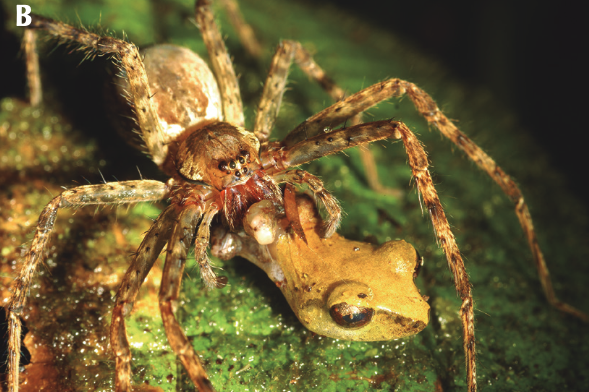

```{r setup, include=FALSE}
knitr::opts_chunk$set(
	echo = TRUE,
	message = FALSE,
	warning = FALSE,
	cache = TRUE
)
```

## Linear Regression Analysis in R

For each of the following datasets, run a regression analysis in R using the 'lm()' function. Report your results in a Word Document using the following template, which we discussed in class:

**For each 1 [x-unit] increase in [x], we observed a [slope][y-unit](+/-[95% C.I.], +/-95% C.I.) [increase/decrease] in [y] (p = [p-value]; r^2 = [r^2]).**

If your results are not statistically significant, be sure to say so in your results sentence. Also, be sure to report the exact p-value; don't use p < 0.0001. Finally, plot the data and the best-fit line to the data.

Compile all of your results in a Word document. This will be one sentence and one graph for each of the three problems; I don't need anything else. Load this into the WebCampus assignment portal and submit it by the due date indicated in the course schedule.

### Dataset 1

[Dataset](exercise2_dataset1.csv)

In this dataset, you are interested in examining the relationship between the density of *Ctenus* sp. (wandering spiders; y-variable -- spiders / sq. meter) as a function of the density of small frogs (x-variable; frogs / sq. meter). For those that are interested, in many tropical rainforests these wandering spiders are major predators of small, terrestrial frogs. Assume that you were in Costa Rica and you captured all of the spiders and frogs you could find in independent rainforest plots (10 $m^2$). You calculated the density of each type of spider (spiders/sq. meter area). What is the relationship between frog and spider density?

{width=50%}

Picture: Witold Lapinski

<br>

### Truth

If you would like to know the values used to create these datasets (i.e., 'truth'), download and examine this [R script](exercise_2.R).

```{r datasets, echo=FALSE, message=FALSE, warning=FALSE}
### Exercise 2: code to simulate datasets 

# Set the seed for reproducibility
set.seed(123)

## Dataset 1

# Simulate X-variable
n <- 40
x <- runif(n, 0, 1) * 0.5

# Simulate error
error <- rnorm(n, mean = 0, sd = 0.4)

# Calculate Y-variable
y <- abs(0.1 + 2 * x + error) # abs() gets rid of negative numbers drawn by chance

# Create dataframe
datum <- data.frame(PreyFrogs = x, Spiders = y)

# Save the CSV file
write.csv(datum, "exercise2_dataset1.csv")

## Dataset 2

# Simulate X-variable
n <- 480
x <- round(runif(n, 50, 3000), 0)

# Simulate error
error <- rnorm(n, mean = 0, sd = 5)

# Calculate Y-variable
y <- abs(20 - 0.001 * x + error) # abs() gets rid of negative numbers drawn by chance

# Create dataframe
datum <- data.frame(Elevation = x, Size = y)

# Save the CSV file
write.csv(datum, "exercise2_dataset2.csv")

## Dataset 3

# Simulate the X-variable
n <- 140
Predators <- runif(n, 0, 1) * 20

# Simulate the error
error <- rnorm(n, mean = 0, sd = 120)

# Simulate Y-variable
Time <- round(rep(360, n) + error, 0)

# Create dataframe
datum <- data.frame(Predators = Predators, Time = Time)

# Save the CSV file
write.csv(datum, "exercise2_dataset3.csv")
```

[--go to next exercise--](exercise_4.html)
