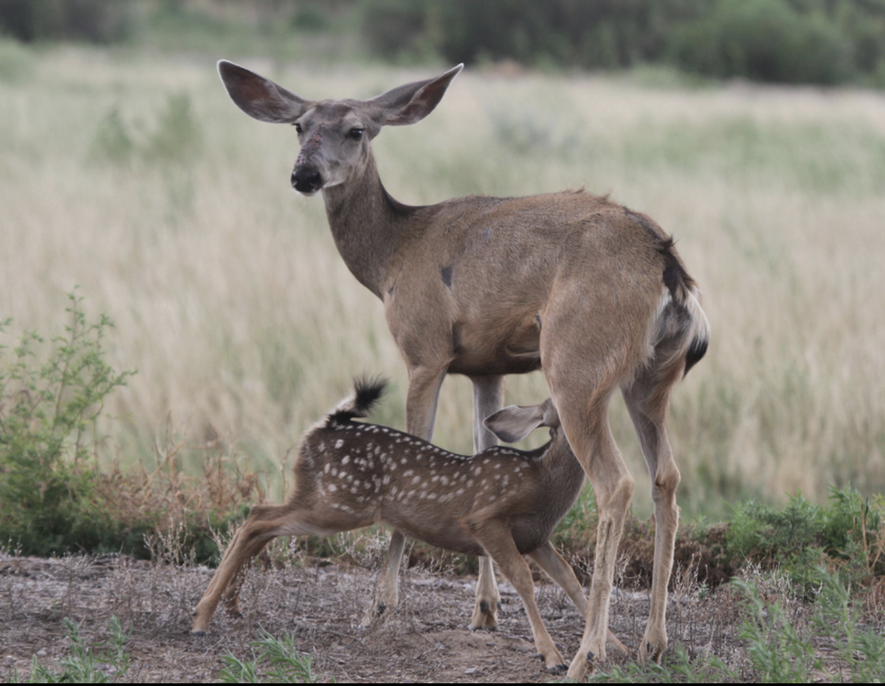

```{r setup, include=FALSE}
knitr::opts_chunk$set(
	echo = TRUE,
	message = FALSE,
	warning = FALSE,
	cache = TRUE
)
```

## Exercise 5 -- Multivariable Analysis and Collinearity

## Problems

**[Dataset 1](exercise_4_dataset1.csv)** -- For this dataset, you are conducting an experiment to see if there is a difference in deer density (Y; deer/ha) between predator exclusion plots and control plots (X; groups). Technically, this could be analyzed with a 't-test'. However, for consistency with our general approach toward statistics, please use the 'lm()' function to do the analysis -- not the 't.test()' function. Report your results using the standard sentence.

{width=50%}

Picture: James Stewart

<br>

## Truth

If you would like to know the values used to create these datasets (i.e., 'truth'), download and examine this [R script](exercise_5.R).

```{r datasets, echo=FALSE, message=FALSE, warning=FALSE}
### Exercise 5: code to simulate datasets for multi-variable analysis

# Set the seed for reproducibility
set.seed(123)

## Dataset 1
# Simulate X-variable
n <- 50
Group <- factor(c(rep("Control", n/2), rep("Exclusion", n/2)))
Exclusion <- c(rep(0, n/2), rep(1, n/2))

# Simulate error
error <- rnorm(n, mean = 0, sd = 1)

# Calculate Y-variable
Density <- 5 + 2.5 * Exclusion + error

# Create dataframe
datum <- data.frame(Group, Exclusion, Density)

# Save the CSV file
write.csv(datum, "exercise_4_dataset1.csv")
```

[--go to next exercise--](exercise_6.html)
