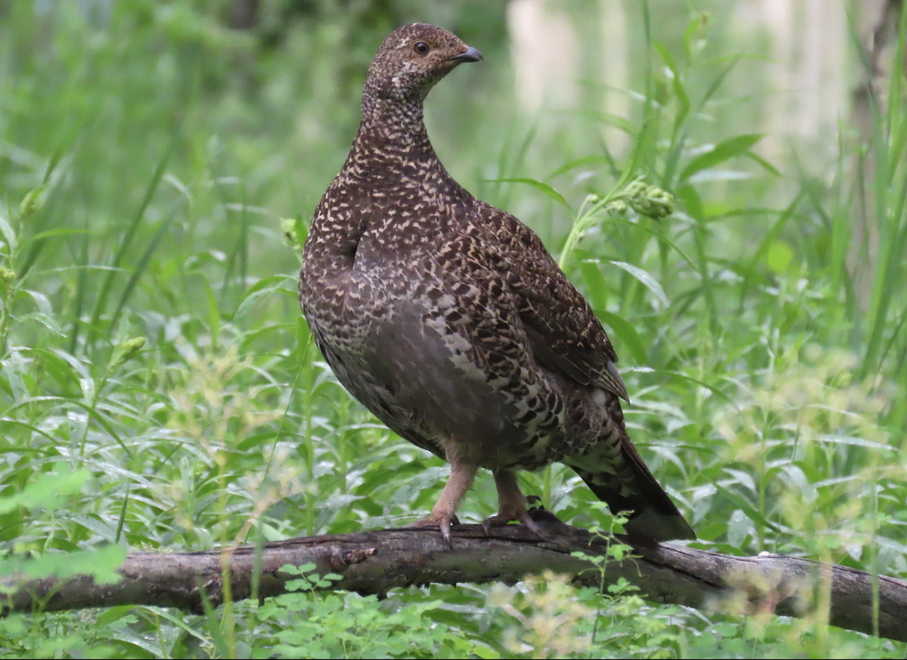
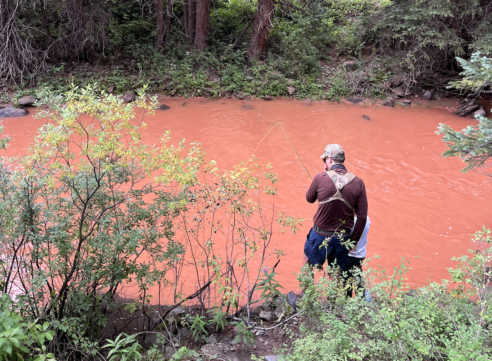

```{r setup, include=FALSE}
knitr::opts_chunk$set(
	echo = TRUE,
	message = FALSE,
	warning = FALSE,
	cache = TRUE
)
```

## Problem 1

**[Dataset 1](exercise_5_dataset1.csv)** -- For this dataset, you are studying how body size (kg) of dusky grouse (*Dendragapus obscurus*) (response variable) is influenced by two continuous factors, elevation (meters above sea level) and latitude (degrees north of the equator), and one categorical variable with three groups (state; Colorado, Nevada, Utah). There is no collinearity between variables.

1. Write a linear (statistical) model that describes a single multi-variable system containing all of the X-variables; be sure to specify what each X-variable represents.
2. What do the various $\beta$s mean in this model?
3. Analyze the data using a single multi-variable model [i.e., with 'lm()' in R]. Write example sentences that you might include in a manuscript you are submitting for publication that describes the observed results. Note: you will need a total of five sentences here; be sure to include a sentence comparing each pair of countries.
4. *Optional*: For an extra learning experience, try running a post-hoc test of your multi-variable model to determine the difference between the three countries. Note: you would have to convert your model to an analysis of variance ('AOV') object before you could run a post-hoc test, and will have to specify the variable you want to run the post-hoc test for. While it may ~run, are there any red flags that indicate it didn't do quite what you intended it to?

{width=50%}

Picture: Hannah Floyd, iNaturalist

<br>

## Problem 2

**[Dataset 2](exercise_5_dataset2.csv)** -- For this dataset, you are studying how the population density of yellow-bellied marmots (*Marmota flaviventris*) (response variable) is influenced by two continuous variables, plant food abundance and understory cover. These two continuous variables are collinear and are potentially confounding: more plant food abundance can cause more marmots, but more understory cover can also cause more marmots also because it provides protection from predators. The data were created such that marmot density is truly affected by both of the continuous variables. Understory cover ranges from 0 to 1 (percent of a density board seen from 15 meters away); food is kg of browse per square meter and is collinear with understory density (marmots eat their cover). The response variable is marmots per hectare. Examine the code used to simulate the data to get the values of 'Truth'. 

1. Load the data into Rstudio.
2. Plot the relationship between understory cover (X) and plant food (Y). Copy and paste this graph into a Word document with all of your results.
3. Calculate the $r^2$ between understory cover and food. Report this value in your results document.
4. Plot the relationship between marmot density (Y) and understory cover (X). Paste this graph in your results document.
5. Plot the relationship between marmot density (Y) and food (X). Paste the graph in your results document.
6. Run a simple regression between marmot density and food. Report your results in your document using the standard sentence.
7. Run a simple regression between marmot density and cover. Report your results in your results document using the standard sentence.
8. Run a multiple regression between marmot density (Y) and both cover (X) and food (X). Report your results in your results document using the standard sentence (or in this case, two sentences; one for each X-variable).
9. Calculate the variance inflation factor (VIF) for both plant food and understory cover density. Report the VIFs in your results document.
10. In your results document, describe what happened in 6, 7, and 8 above. Be sure to discuss:
    - The coefficient estimates of the explanatory X-variable(s) relative to 'Truth' and other models you ran.
    - What your final model would be in this analysis (be sure to explain why) and how you would deal with the collinearity among variables.
    - What you've learned from the exercise.

{width=50%}

Picture: Hannah Floyd, iNaturalist

<br>

## Problem 3

**[Dataset 3](exercise_5_dataset3.csv)** -- For this dataset, you are studying how water clarity (response variable) is influenced by two continuous variables, sediment load and amount of organic material. Here, the two continuous variables are collinear, but are potentially redundant: both are basically indicators of run-off, which is really driving water clarity. The data were created such that water clarity is actually a function of a third explanatory X-variable, run-off. The run-off data are included in the R code used to generate the data, but are not included in the CSV file you are analyzing; pretend that you didn't collect data on run-off and thus you don't have any data describing that variable. Sediment and organic material are both correlated with run-off, but sediment is much more closely related to run-off and thus is a better index of run-off. Sediment and organic matter might be grams per cubic meter, run-off might be cubic-feet / minute, and clarity might be depth (centimeters) a secchi disk can be seen from -- although the relationships or numbers might not be realistic. Examine the equations in the R script for 'truth' to see how the data were made and get the values of truth.

1. Load the data into Rstudio.
2. Plot the relationship between sediment (X) and organic matter (Y). Copy and paste this graph into a Word document with all of your results.
3. Calculate the $r^2$ between sediment and organic matter. Report this value in your results document.
4. Plot the relationship between clarity (Y) and sediment (X). Paste this graph in your results document.
5. Plot the relationship between clarity (Y) and organic matter (X). Paste the graph in your results document.
6. Run a simple regression between clarity (Y) and sediment (X). Report your results in your document using the standard sentence.
7. Run a simple regression between clarity (Y) and organic matter (X). Report your results in your results document using the standard sentence.
8. Run a multiple regression between clarity (Y) both sediment (X) and organic matter (X). Report your results in your results document using the standard sentence (or in this case, two sentences; one for each X-variable).
9. Calculate the variance inflation factor (VIF) for both sediment and organic matter. Report the VIFs in your results document.
10. In your results document, describe what happened in 6, 7, and 8 above. Be sure to discuss:
    - The coefficient estimates of the explanatory X-variable(s) and how they changed throughout the analysis (and why).
    - What your final model would be in this analysis (be sure to explain why) and how you would deal with the collinearity among variables.
    - What you've learned from the exercise.
    
{width=50%}

Tough fishing conditions in Hermosa Creek, Colorado (Picture: Jason Folt).

<br>

## Truth

If you would like to know the values used to create these datasets (i.e., 'truth'), examine the code here:

```{r}
########################## 'Truth' ############################# 
### Exercise 5: code to simulate datasets for the exploration of
### collinearity in multi-variable analysis

# Set the seed for reproducibility
set.seed(123)

## Dataset 1
# Sample size
n <- 90

# Simulate X-variables
# Continuous variables: Latitude and Elevation
Latitude <- runif(n, 0, 1) * 5 + 37
Elevation <- runif(n, 0, 1) * 1000 + 2000

# Categorical variable: State
g <- 3 # number of groups
State <- factor(c(rep("Colorado", n/g), rep("Nevada", n/g), rep("Utah", n/g)))

# Dummy-code the States
dummy <- data.frame(model.matrix(~ State - 1))
colnames(dummy) <- c("Colorado", "Nevada", "Utah")

# Error
Error <- rnorm(n, mean = 0, sd = 1)

# Response variable: Size
Size <- 45 - 0.95*Latitude - 0.00167*Elevation + 2*dummy$Nevada + 1*dummy$Utah + Error

# Create dataframe
datum <- data.frame(Latitude=Latitude, Elevation=Elevation, Nevada=dummy$Nevada,
                    Utah=dummy$Utah, Size=Size)

# Save the CSV file
write.csv(datum, "exercise_5_dataset1.csv")


## Dataset 2
# Sample size
n <- 100

# Simulate two continuous X-variables
Cover <- runif(n, 0, 1)
Food <- 3 + 3*Cover + rnorm(n, 0, 0.5)

# Error
Error <- rnorm(n, mean = 0, sd = 0.1)

# Response variable: Density
MarmotDensity <- 0.01 + 3*Cover + 2*Food + Error

# Create dataframe
datum <- data.frame(Cover = Cover, Food = Food, MarmotDensity = MarmotDensity)

# Save the CSV file
write.csv(datum, "exercise_5_dataset2.csv")


## Dataset 3
# Sample size
n <- 100

# X-variables
# The 'true' X-variable: RunOff
RunOff <- runif(n, 0, 100)

# Collinear X-variables
Sediment <- matrix(NA, n, 1)
for (i in 1:n){
  # Each sediment value is simulated using the mean of the RunOff value with a bit of noise (3)
  Sediment[i] <- rnorm(1, RunOff[i], 3)
}
Organic <- matrix(NA, n, 1)
for (i in 1:n){
  # Each organic matter value is simulated using the mean of RunOff with a lot of noise (15)
  Organic[i] <- rnorm(1, RunOff[i], 15)
}

# Error
Error <- rnorm(n, 0, 2)

# Response variable
Clarity <- 50 - 0.4 * RunOff + Error

# Dataframe
datum <- data.frame(Sediment, Organic, Clarity)

# Save the CSV file
write.csv(datum, "exercise_5_dataset3.csv")
```

[--go to next exercise--](exercise_6.html)
