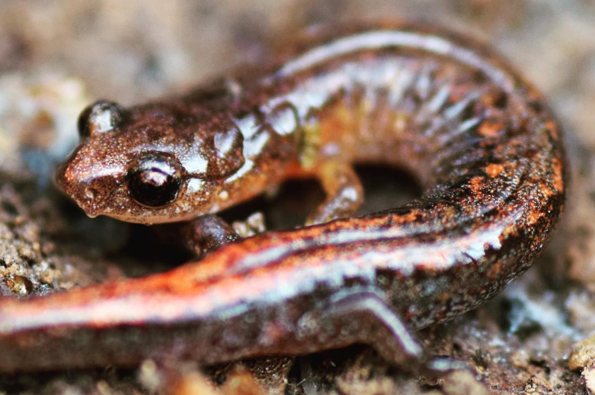

```{r setup, include=FALSE}
knitr::opts_chunk$set(
	echo = TRUE,
	message = FALSE,
	warning = FALSE,
	cache = TRUE
)
```

## General Approach

Put all your answers in a summary document and, as always, share that with me to get credit for the assignment. In general, while we should always report the betas and C.I. from our analyses on main effects, I believe that if interactions are non-significant that it is sufficient to say say so (e.g., 'We built a model that included an interaction between the [x-variable] and [x-variable]; however, the result was not statistically significant (p = [p-value])." and then (1) remove the interaction from the model, (2) re-run the analysis, and (3) extract and report the other betas from main effects. The main reason is because interactions make everything so much more complicated.

## Problem 1

**[Dataset 1](exercise_5_dataset1.csv)** -- For this dataset, you have a continuous x-variable (e.g., road density [roads/sq. km]) and one categorical x-variable (aspen vs. pine forest). You want to learn about the effects of road density and forest type on Douglass' Squirrel (*Tamiasciurus douglasii*) density (squirrels / hectare). In this system, there is an interaction between road density and forest type.

1. Write a linear (statistical) model that describes the system; be sure you specify what each $X$-variable represents.
2. What do the various $\beta$s mean in this model?
3. Run the full model in R. Report whether or not the interaction is significant or not (including p-value)
4. Analyze data from the two forest types separately and describe the results using the standard sentences.
5. Note that the squirrel density is higher in pine at low road density and lower in pine at high road density. At what road density is squirrel density the same between both forest types?

<br>

## Problem 2

**[Dataset 2](exercise_5_dataset2.csv)** -- For this dataset, you have two categorical factors (e.g., Sex and Treatment) and each factor has two levels [male + female, control (placebo) + hormone injection]. The dependent variable is adult body size. In this system, there is an interaction between sex and treatment.

1. Write a linear (statistical) model that describes the system; be sure you specify what each $X$-variable represents.
2. What do the various $\beta$s mean in this model?
3. Run the full model in R. Report whether or not the interaction is significant or not (including p-value).
4. Analyze data from the two sexes separately and describe the results using the standard sentences.

<br>

## Problem 3

**[Dataset 3](exercise_5_dataset3.csv)** -- For this dataset, you have two continuous variables (e.g., Elevation - meters asl; and Latitude - km). The dependent variable is Red-backed Salamander (*Plethodon cinereus*) body size (g). In this system, there is an interaction between elevation and latitude.

1. Write a linear (statistical) model that describes the system; be sure you specify what each $X$-variable represents.
2. What do the various $\beta$s mean in this model?
3. Run the full model in R. Report whether or not the interaction is significant or not (including p-value)
4. Write example sentences that you might include in a manuscript for publication that describes the observed results. First describe the effect of elevation (at zero latitude). Then describe the effect of latitude (at zero elevation). Finally, describe how the effect of elevation changes as latitude increases (or vice versa). The following sentence might help:

"We found a significant interaction (p = [p-value for interaction term]), such that for each 1 [x1 units] increase in [x1], we observed that the slope of the [x2]-[y] relationship [increased/decreased] by [beta for interaction][y units]/[x2 units] ([95% C.I. of beta for interaction]; +/-95% C.I.)."

{width=50%}

Webster's Salamander (*Plethodon websteri*) -- a cousin of the red-backed salamander.

<br>

## Truth

If you would like to know the values used to create these datasets (i.e., 'truth'), examine the code here:

```{r}
########################## 'Truth' ############################# 
### Exercise 5: code to simulate datasets for the exploration of
### interactions in multi-variable analysis

# Set the seed for reproducibility
set.seed(123)

### Dataset 1
# Sample size
n <- 60

# Road density
RoadDensity <- runif(n, 0, 1) * 10

# Forest type
g <- 2 # number of groups
ForestType <- factor(c(rep("Aspen", n/g), rep("Pine", n/g)))

# Dummy-code the ForestType
dummy <- data.frame(model.matrix(~ ForestType - 1))
colnames(dummy) <- c("Aspen", "Pine")

# Error
Error <- rnorm(n, mean = 0, sd = 1)

# Response variable
Squirrels <- 10 - 0.5*RoadDensity + 1*dummy$Pine - 0.5*dummy$Pine*RoadDensity + Error

# Dataframe
datum <- data.frame(RoadDensity, ForestType, Squirrels)

# Save the CSV file
write.csv(datum, "exercise_5_dataset1.csv")


### Dataset 2
# Sample size
n <- 100

# Sex
g <- 2 # number of groups
Sex <- factor(c(rep("Females", n/g), rep("Males", n/g)))
Treatment <- rep(c(rep("Control", 25), rep( "Treatment", 25)), 2)

# Dummy-code the Sex
dummySex <- data.frame(model.matrix(~ Sex - 1))
colnames(dummySex) <- c("Female", "Male")

# Dummy-code the Treatment
dummyTreatment <- data.frame(model.matrix(~ Treatment - 1))
colnames(dummyTreatment) <- c("Control", "Treatment")

# Error
Error <- rnorm(n, mean = 0, sd = 0.2)

# Response variable
Size <- 1.5 + 0.5*dummySex$Male + 0.5*dummyTreatment$Treatment + 0.5*dummySex$Male*dummyTreatment$Treatment + Error

# Dataframe
datum <- data.frame(Sex, Treatment, Size)

# Save the CSV file
write.csv(datum, "exercise_5_dataset2.csv")


### Dataset 3
# Sample size
n <- 90

# Simulate X-variables
# Continuous variables: Latitude and Elevation
Latitude <- runif(n, 0, 1) * 3000
Elevation <- runif(n, 0, 1) * 2500

# Error
Error <- rnorm(n, 0, 1)

# Response variable: Size
Size <- 15 - 0.00125*Elevation - 0.00167*Latitude + 0.00001 * Latitude * Elevation 

# Create dataframe
datum <- data.frame(Latitude=Latitude, Elevation=Elevation, Size=Size)

# Save the CSV file
write.csv(datum, "exercise_5_dataset3.csv", row.names = FALSE)

```

[--go to next exercise--](exercise_6.html)
