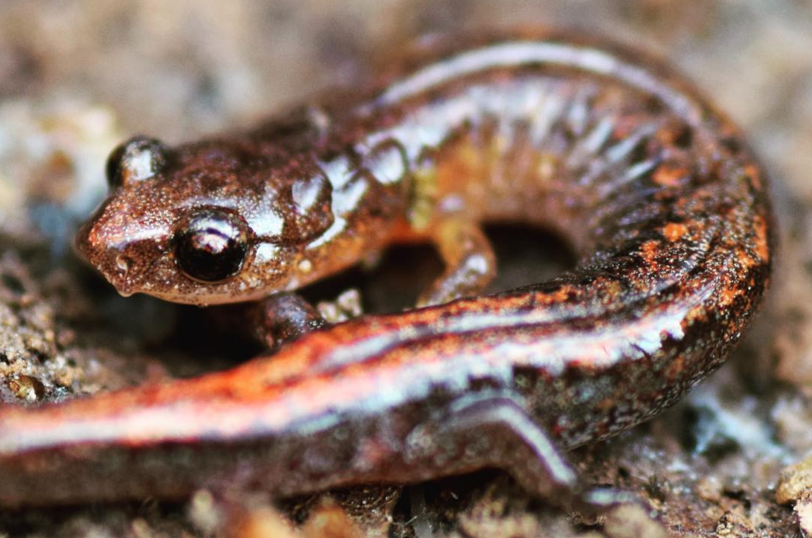

```{r setup, include=FALSE}
knitr::opts_chunk$set(
	echo = TRUE,
	message = FALSE,
	warning = FALSE,
	cache = TRUE
)
```

## General Approach

...

## Problem 1

**[Dataset 1](exercise_6_dataset1.csv)** -- For this dataset, ...

1. ...

{width=50%}

Webster's Salamander (*Plethodon websteri*) -- a cousin of the red-backed salamander.

<br>

## Truth

If you would like to know the values used to create these datasets (i.e., 'truth'), examine the code here:

```{r}
########################## 'Truth' ############################# 
### Exercise 6: code to simulate datasets for the exploration of
### mixed-effects models

# Set the seed for reproducibility
set.seed(123)

### Dataset 1
# Sample size
n <- 90

# Simulate X-variables
# Continuous variables: Latitude and Elevation
Latitude <- runif(n, 0, 1) * 3000
Elevation <- runif(n, 0, 1) * 2500

# Error
Error <- rnorm(n, 0, 1)

# Response variable: Size
Size <- 15 - 0.00125*Elevation - 0.00167*Latitude + 0.00001 * Latitude * Elevation 

# Create dataframe
datum <- data.frame(Latitude=Latitude, Elevation=Elevation, Size=Size)

# Save the CSV file
write.csv(datum, "exercise_6_dataset1.csv", row.names = FALSE)

```

[--go to next exercise--](exercise_7.html)
