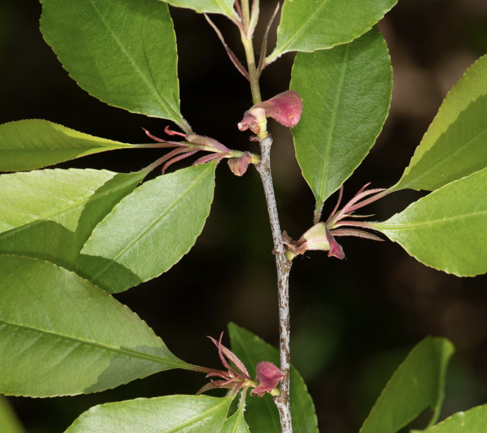

```{r setup, include=FALSE}
knitr::opts_chunk$set(
	echo = TRUE,
	message = FALSE,
	warning = FALSE,
	cache = TRUE
)
```

## General Approach

There are three datasets to analyze for this exercise. For each dataset, please conduct the following analyses:

1. Analyze the data using a standard linear model with 'lm()'; do not include any random effects. Report your results describing the fixed effects with the standard sentence(s).
2. Analyze the data with random effects (random intercept) using a linear mixed-effects model with 'lme()' from the 'nlme' package. Report your results on the fixed effects using the standard sentence(s).
3. Report what the standard deviation due the random effect is.
4. Report how the results from the 'lm()' and 'lme()' approaches differ.

Note: the 'confint' function doesn't report confidence limits from 'lme()' results the same way it does for 'lm()' results. To calculate the confidence intervals, use 'intervals(results)' instead.

## Problem 1

**[Dataset 1](exercise_6_dataset1.csv)** -- We are worried about the effects of Mormon Crickets (*Anabrus simplex*) on agricultural landscapes. We performed an experiment with 8 fields; within each field, we had three different plots, which were randomly assigned to one of three 'treatments': control, pesticide application, and prescribed fire application. The burn treatment was called 'PrescrBurn' for reasons you should be able to figure out. We can't test for an interaction between burn and fertilizer, because no plots received both treatments. This means the treatments are different groups within a single variable -- not different variables. The response variable being measured is population density (crickets/hectare). Create a graph (e.g., box plots) that visualizes differences in the response variable between groups. Using the standard sentence(s), report the estimated difference in population density among all three treatments. This will require three sentences.

{width=50%}

Picture: John Sullivan, iNaturalist

<br>

## Problem 2

**[Dataset 2](exercise_6_dataset2.csv)** -- We want to understand the effects of fertilizer and hormones on Black Cherry (*Prunus serotina*) tree growth. In this experiment, we performed an experiment with 10 fields; within each field, we had four different plots. In the plots, two levels of fertilizer (0 grams, 5 grams) are crossed in a fully-factorial manner with two levels of hormone treatment (0 = no hormones given; 1 = hormones give). So within each field, one plot receives no fertilizer and no hormones, two plots receive one of the treatments, and one plot receives both treatments. This is called a fully factorial experiment. Thus, fertilizer and hormones are two separate fixed-effects variables (which contrasts to Dataset #1). Our response variable is the trunk diameter of trees in each plot (cm). Create a graph (e.g., box plots) that visualizes differences in the response variable between groups. This experimental design allows us to test for an interaction between the two variables, and we should do so! Report the results of the interaction, but remember: if the interaction isn't significant, take it out of the model before reporting the main effects. Using the standard sentences, report the 'effects' of fertilizer, hormone, and the interaction (if there is one).

{width=50%}

Picture: Heather Holm, iNaturalist

<br>

## Problem 3

**[Dataset 3](exercise_6_dataset3.csv)** -- In this dataset, we want to determine the growth trajectory of Whitebark Pine Trees (*Pinus albicaulis*) from 10 years old to 20 years old. We repeatedly measure the size (height; meters) of 16 different individuals each year of the study and examine the relationship between age and size. Create a graph (e.g., standard plot) that visualizes the effect of age on size of trees; illustrate the individual trees as different using the 'pch' command in 'plot()'. In addition to running the fixed-effects model and the standard mixed model, also run a model that incorporates a 'moving average' autocorrelation. Run an F-drop test to see if including the autocorrelation parameter significantly improves the fit of the model to the data. Report the results of this F-drop test. Also report the value of $\theta$ (the coefficient of autocorrelation) in your assignment, along with the standard deviation due to the random effect.

{width=50%}

Picture: Gary Griffith, iNaturalist

<br>

## Problem 4

**[Dataset 4](exercise_6_dataset4.csv)** -- In this dataset, we want to determine the growth of Big Sagebrush (*Artimesia tridentata*) from along soil moisture gradients in 10 different basins in central Nevada. We measure the biomass (kg) of 20 sagebrush plants in each basin and related each measurement to soil moisture. Create a graph (e.g., standard plot) that visualizes the effect of soil moisture on sagebrush biomass; illustrate the measurements by basin using the 'pch' command in 'plot()'. In addition to running the fixed-effects model and the standard mixed model, also run a mixed model that incorporates an interaction between soil moisture and basin. Run an F-drop test to see if including the random interaction effect significantly improves the fit of the model to the data. Report the results of this F-drop test. Report the standard deviation due to the random interaction effect in addition to the random intercept effect.

{width=50%}

<br>

## Truth

If you would like to know the values used to create these datasets (i.e., 'truth'), examine the code here:

```{r}
########################## 'Truth' ############################# 
### Exercise 6: code to simulate datasets for the exploration of
### mixed-effects models

### Dataset 1
# Set the seed for reproducibility
set.seed(123)

# X-variables
n_fields <- 8
n_treatments <- 3
Fields <- rep(1:n_fields, each = n_treatments)
Treatment <- rep(c("Control", "Pesticide", "PrBurn"), n_fields)
TrtMnt <- rep(c(0,1,1), n_fields)

# Error due to field
FieldError <- rep(rnorm(n_fields, 0, 3.5), each = n_treatments)

# Residual error
ResidError <- rnorm(n_treatments * n_fields, 0, 2)

# Response variable
Density <- 20 - 6*TrtMnt + FieldError + ResidError

# Create dataframe
datum <- data.frame(Fields=Fields, Treatment=Treatment, FieldError=FieldError, ResidError=ResidError, TrtMnt = TrtMnt, Density=Density)

# Save the CSV file
write.csv(datum, "exercise_6_dataset1.csv", row.names = FALSE)


### Dataset 2
# Set the seed for reproducibility
set.seed(121)

# X-variables
n_fields <- 10
n_treatments <- 4
Fields <- sort(rep(1:n_fields, n_treatments))
Fertilizer <- c(rep(0, n_fields), rep(1, n_fields), rep(0, n_fields), rep(1, n_fields))
Hormone <- c(rep(0, n_fields), rep(0, n_fields), rep(1, n_fields), rep(1, n_fields))

# Error due to field
FieldError <- rep(rnorm(n_fields, 0, 6.5), each = n_treatments)

# Residual error
ResidError <- rnorm(n_treatments * n_fields, 0, 1)

# Response variable
Size <- 50 + 9*Fertilizer + 3*Hormone + FieldError + ResidError

# Create dataframe
datum <- data.frame(Fields=Fields, Fertilizer=Fertilizer, Hormone=Hormone, FieldError=FieldError, ResidError=ResidError, Size=Size)

# Save the CSV file
write.csv(datum, "exercise_6_dataset2.csv", row.names = FALSE)


### Dataset 3
# Set the seed for reproducibility
set.seed(123)

# X-variables
n_trees <- 16
years <- 10:20
n_years <- length(years)
Individual <- sort(rep(1:16, n_years))
Age <- years

# Tree error
TreeError <- rep(rnorm(n_trees, 0, 10), each = n_years)

# Residual error
ResidError <- matrix(NA, n_trees * n_years, 1)
ResidError[1,1] <- rnorm(1, mean = 0, sd = 12)
for (i in 2:(n_trees * n_years)){
  ResidError[i,1] <- rnorm(1, mean = ResidError[i-1, 1], sd = 1)
}

# Response variable
Size <- 20 + 1*Age + TreeError + ResidError

# Create dataframe
datum <- data.frame(Individual=Individual, Age=Age, TreeError=TreeError, ResidError=ResidError, Size=Size)

# Save the CSV file
write.csv(datum, "exercise_6_dataset3.csv", row.names = FALSE)


### Dataset 4
# Effect of soil moisture on sagebrush biomass in different basins in Nevada.
# Set seed
set.seed(123)

# Simulate data
n_basins <- 10
Basin <- sort(c(rep(1:n_basins, 20)))

# Continuous X-variable
SoilMoisture <- runif(length(Basin), 0, 1)

# Basin error (matching the number of samples for each basin)
BasinError <- c(rep(rnorm(Basin, 0, 5), each = 5))

# Field X SoilMoisture interaction error (matching the number of samples for each field)
BasinXMoistureError <- c(rep(rnorm(Basin, 0, 3), each = 5))

# Within-basin error
Error <- rnorm(length(Basin), 0, 1)

# Response variable
Biomass <- 25 + 10*SoilMoisture + SoilMoisture*BasinXMoistureError + BasinError + Error

# Save the data
datum <- data.frame(Basin = Basin, SoilMoisture = SoilMoisture, BasinXMoistureError = BasinXMoistureError, BasinError = BasinError, Error = Error, Biomass = Biomass)

# Save the data
write.csv(datum, "exercise_6_dataset4.csv", row.names = FALSE)

```

[--go to next exercise--](exercise_7.html)
