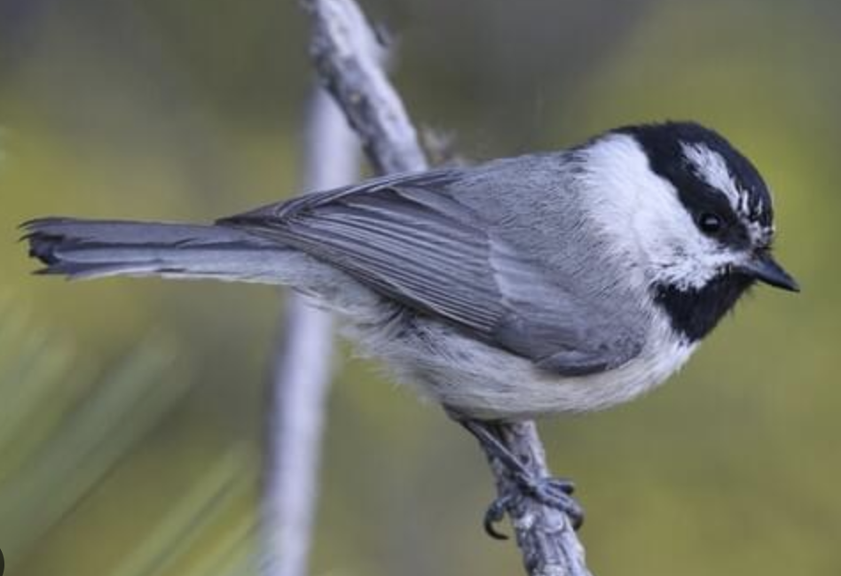

```{r setup, include=FALSE}
knitr::opts_chunk$set(
	echo = TRUE,
	message = FALSE,
	warning = FALSE,
	cache = TRUE
)
```

## General Approach

There are three datasets to analyze for this exercise. For each dataset, follow the directions to work through different analyses and report the results.

## Problem 1 -- Nested Design

**[Dataset 1](exercise_7_dataset1.csv)** -- In this dataset, we want to understand how the abundance of Mountain Chickadees (*Poecile gambeli*) varies by heat index and elevation in the Carson Range. There are four study sites where chickadee abundance is surveyed each June with breeding surveys, where the number of seen during point counts is used as an estimate of population size. Within each site, there are four plots. Each plot falls into one of four categories: low elevation and low heat index, high elevation and low heat index, low elevation and high heat index, and high elevation and high heat index. Within each plot, there are four samples where chickadee abundance was measured. This is a fully factorial study design; thus, heat and elevation are two separate fixed-effects variables, and our response variable is tree abundance. Create a graph (e.g., box plots) that visualizes differences in the response variable between groups. This study design allows us to test for an interaction between the two variables, and we should do so! Report the results of the interaction, but remember: if the interaction isn't significant, take it out of the model before reporting the main effects. Using the standard sentences, report the 'effects' of heat, elevation, and the interaction (if there is one).

Please conduct the following analyses:

**1a.** Analyze the data using a standard linear model with 'lm()'; do not include any random effects. Report your results describing the fixed effects with the standard sentence(s). Report the sample sizes associated with each test of your effects.   
**1b.** Analyze the data with a linear mixed-effects model with 'lme()' from the 'nlme' package. If there might be multiple random effects, consider whether they might be 'nested' and handle this appropriately in your analysis. Report your results on the fixed effects using the standard sentence(s). Report the sample sizes (*n* and DF) associated with each test of your fixed effects.    
**1c.** Report what the standard deviation due to the random effect are.    
**1d.** Report how the results from the 'lm()' and 'lme()' approaches differ.   

Note: the 'confint' function doesn't report confidence limits from 'lme()' results the same way it does for 'lm()' results. To calculate the confidence intervals, use 'intervals(results)' instead.

{width=50%}

Picture: Cornell Laboratory of Ornithology

<br>

## Problem 2 -- Before-After Control-Impact Design

**[Dataset 2](exercise_7_dataset2.csv)** -- In this dataset, we are studying a lizard that lives in lowland rainforests in Costa Rica, the Humble Anole (*Norops humilis*). We want to know whether anole populations are regulated by food abundance. The anoles eat small arthropods. We selected ten areas in the rain forest that the *N. humilis* are present and set up 15m x 15m study plots. We estimated the population size of lizards in each plot using mark-recapture methods during the month of January. We then randomly-selected three study plots and experimentally manipulated the amount of food available to lizards by setting out tuna cans that attracted insects. We supplemented food all year and resurveyed the lizard populations every three months: in April, July, and October.

This is a **Before-After Control-Impact (BACI)** study design. We are specifically interested in understanding how lizard population size (number of lizards) varies seasonally (different months) and whether food supplementation changes the population cycle through time (i.e., season x treatment interaction). If you recover a significant interaction, report then, then simplify your analysis. Specifically, recall my guidance from class: split the data into the different months, and then report the effects of treatment for each month.

**2a.** Create a graph (e.g., box plots) that visualizes differences in the response variable by month and treatment group.    
**2b.** Build a mixed-effects model to test 'effects' of treatment, month, treatment x month interactions. Report the results using the standard sentences. Hint: you should have five sentences (one for the overall interaction and one each for the four months). Report your sample sizes (*n* and DF) associated with each sentence.   
**2c**. What was your random effect, and what the standard deviation due to that random effect?    

{width=50%}

Picture: Tobias Eisenberg, Reptile Database.

<br>

## Problem 3 -- Fixed x Random Effect interactions

Create this at a later date 

<br>

## Truth

If you would like to know the values used to create these datasets (i.e., 'truth'), examine the code here:

```{r}
########################## 'Truth' ############################# 
### Exercise 7: code to simulate datasets for the exploration of
### nested mixed-effects models

### Dataset 1
# Simulate study design with four sites; each site has four plots; each plot receives one of four treatments; each plot has four different samples. 
set.seed(123) # Reproducibility

## Set up study design
# Plots
n_sites <- 4
n_plots <- 4
n_samples <- 4

# Site
Site <- sort(rep(rep(1:n_sites, n_plots*n_samples)))

# Heat
Heat <- rep(c(rep(0, n_samples), rep(1, n_samples), rep(0, n_samples), rep(1, n_samples)), n_sites)

# Elevation
Elevation <- rep(c(rep(0, n_samples), rep(0, n_samples), rep(1, n_samples), rep(1, n_samples)), n_sites)

# Treatment
Treatment <- factor(rep(c("HLEL", "HHEL", "HLEH", "HHEH"), each = 4, times = n_sites),
                    levels = c("HLEL", "HHEL", "HLEH", "HHEH"))

# Plot
Plot <- rep(sort(rep(1:4, n_samples)), n_sites)

# Sample
Sample <- rep(rep(1:4, n_samples), n_sites)

## Simulate error
# Site error
SiteError <- rep(rnorm(n_sites, 0, 4), each =  n_plots * n_samples)

# Plot error
PlotError <- rep(rnorm(n_plots * n_sites, 0, 2), each = n_samples)

# Residual error (i.e., sample error)
ResidualError <- rnorm(length(Plot), 0, 1)

# Response variable -- birds per sample
BirdDensity <- 50 + 2*Heat + 3*Elevation + 6*Heat*Elevation + SiteError + PlotError + ResidualError

# Save the data
datum <- data.frame(Site = Site, Heat = Heat, Elevation = Elevation, Treatment = Treatment, Plot = Plot, Sample = Sample, SiteError = SiteError, PlotError = PlotError, ResidualError = ResidualError, BirdDensity = BirdDensity)

# Save the CSV file
write.csv(datum, "exercise_7_dataset1.csv", row.names = FALSE)


### Dataset 2
# Simulate study design with multiple study plots, two treatments (treatment and control), measured across four seasons; i.e., a Before-After Control-Impact Design.
set.seed(123) # Reproducibility

## Set up study design
# Plots
n_plots <- 10
n_months <- 4

# Month
Month <- factor(rep(c("January", "April", "July", "October"), n_plots), levels = c("January", "April", "July", "October"))

# Dummy-code the Month
dummy <- data.frame(model.matrix(~ Month - 1))
colnames(dummy) <- c("January", "April", "July", "October")

# Treatment
Treatment <- factor(sort(rep(c("Control", "Food+"), each = (n_plots/2) * n_months)), levels = c("Control", "Food+"))
Treated <- data.frame(model.matrix(~ Treatment - 1))
colnames(Treated) <- c("Control", "Treated")

# Plot
Plot <- sort(rep(rep(1:n_plots), n_months))

## Simulate error
# Plot error
PlotError <- rep(rnorm(n_plots, 0, 3.5), each = n_months)

# Residual error (i.e., sample error)
ResidualError <- rnorm(length(Plot), 0, 3)

# Response variable -- lizards per plot in each month
LizardAbundance <- 25 + 0*Treated$Treated + 8*dummy$April + 4*dummy$July - 1*dummy$October + 5*Treated$Treated*dummy$April + 2*Treated$Treated*dummy$July + 0*Treated$Treated*dummy$October + PlotError + ResidualError

# Save the data
datum <- data.frame(Plot = Plot, Month = Month, Jan = dummy$January, Apr = dummy$April, Jul = dummy$July, Oct = dummy$Oct, Treatment = Treatment, Treated = Treated$Treated, PlotError = PlotError, ResidualError = ResidualError, Lizards = LizardAbundance)

# Save the CSV file
write.csv(datum, "exercise_7_dataset2.csv", row.names = FALSE)

```

[--go to next exercise--](exercise_8.html)
