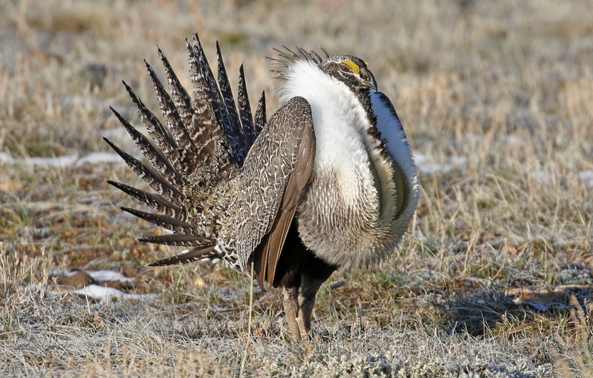

```{r setup, include=FALSE}
knitr::opts_chunk$set(
	echo = TRUE,
	message = FALSE,
	warning = FALSE,
	cache = TRUE
)
```

## General Approach

There are two datasets to analyze for this exercise. For each one, analyze the data using generalized linear modeling with the appropriate statistical distribution (i.e., family). Analyze with regular 'main' effects; there are no interactions, collinearity, or other complications to worry about. For each dataset, write one paragraph summarizing your results with the standard results sentences.

## Problem 1

**[Dataset 1](exercise_8_dataset1.csv)** -- For this problem, you will be doing a habitat analysis to understand whether the presence of Greater-sage Grouse (*Centrocercus urophasianus*) varies by (1) the number of years since the habitat has burned, (2) the density of big sage brush (*Artemisia tridentata*) bushes, (3) whether there is a water source at the site. Your data are 100 surveys in 1-ha sage-brush plots where you noted: whether or not grouse were present (assuming this was done without error), number of years since fire, sage-brush density, and presence/absence of water.

In addition to the results paragraph, answer the following question: What is the average, predicted probability of habitat use by grouse in a stand that burned 15 years ago with a sage-brush density of 150 bushes/ha and a water source present? No need for confidence intervals around this prediction.

{width=50%}

Picture: Donna Pomeroy (iNaturalist)

<br>

## Problem 2

**[Dataset 2](exercise_8_dataset2.csv)** -- For this problem, you are still studying birds, but now you are studying the entire community of birds that live in various habitats in Nevada. You visit 100 sites early in the morning and count the **number of bird species** present at each site (response variable) during a standardized 1-hour survey. You also collected data on habitat type (desert, sage-brush, grassland) and understory density (an index from 0--100 made from observations of a density board: 100% is thick [can't see through it], 0 means no understory [open views!]).

In your results description, be sure to describe the differences among all pairs of habitat types and the effect of understory density. In addition, please answer this question in your results: what is the average, predicted number of bird species in desert habitat with an understory density of 35%? No need to worry about confidence intervals here.

{width=50%}

Picture: Monitor Valley, Nevada (B. Folt).

<br>

## Truth

If you would like to examine the true values used to create these datasets (i.e., 'truth'), examine the code here:

```{r}
########################## 'Truth' ############################# 
### Exercise 8: code to simulate datasets for the exploration of
### generalized linear models (GLMs)

### Dataset 1
set.seed(111) # Reproducibility

## Set up study design
# Plots
n_sites <- 100

# yr_since_burn
mean_lambda <- 10  # Mean of the Poisson component
dispersion <- 2    # Dispersion parameter (larger values = less overdispersion)
yr_since_burn <- rnbinom(n_sites, size = 1 / dispersion, mu = mean_lambda)

# sagebrush density
sagebrush <- round(runif(n_sites, 10, 200), 1)

# water source presence
water <- rbinom(n_sites, 1, 0.4)

# Response variable -- bird presence
mean_presence <- exp(-3 + 0.035*yr_since_burn + 0.01*sagebrush + 2*water)/(1 + exp(-3 + 0.03*yr_since_burn + 0.01*sagebrush + 2*water))
# y_hat; the mean presence for each site, given effects

# Response variable - data
presence <- rep(NA, n_sites)
for (i in 1:n_sites){
  presence[i] <- rbinom(1, 1, mean_presence[i])
  # y_i - simulated each observation of y_i using a random process but given the y_hat mean for each individual
}

# Save the data
datum <- data.frame(YearSinceBurn = yr_since_burn, SageDensity = sagebrush, Water = water, Presence = presence)

# Save the CSV file
write.csv(datum, "exercise_8_dataset1.csv", row.names = FALSE)


### Dataset 2
set.seed(111) # Reproducibility

## Set up study design
# Plots
n_sites <- 120

# habitat type
habitat <- rep(c("desert", "grassland", "sagebrush"), each = n_sites/3)
dummy <- data.frame(model.matrix(~ habitat - 1))
colnames(dummy) <- c("Desert", "Grassland", "Sagebrush")

# understory density
understory <- round(runif(n_sites, 0, 100), 0)

# Response variable -- predicted number of bird species
mean_species <- exp(0 + 2*dummy$Grassland + 1.2*dummy$Sagebrush + 0.015*understory) # y_hat; mean predicted number of species per area
no_species <- rep(NA, n_sites)
# Response variable
for (i in 1:n_sites){
  no_species[i] <- rpois(1, mean_species[i])
  # y_i - simulate each observation of y_i using a random process but given the y_hat mean for each site
}

# Save the data
datum <- data.frame(Habitat = habitat, Desert = dummy$Desert, Grassland = dummy$Grassland, Sagebrush = dummy$Sagebrush, UnderstoryDensity = understory, SpeciesCount = no_species)

# Save the CSV file
write.csv(datum, "exercise_8_dataset2.csv", row.names = FALSE)


```

[--go to next exercise--](exercise_9.html)
