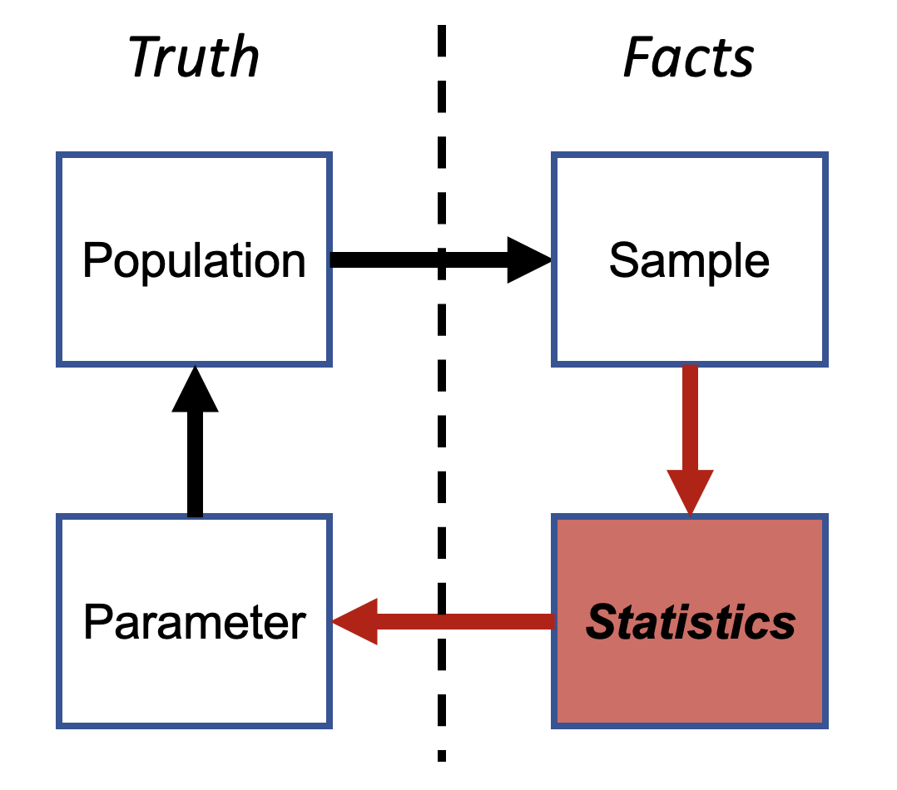
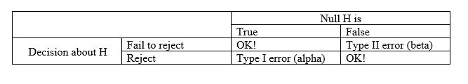

```{r setup, include=FALSE}

knitr::opts_chunk$set(
	echo = TRUE,
	message = FALSE,
	warning = FALSE,
	cache = TRUE
)
```

```{r echo=FALSE}

#  NRES 710, Lecture 3                         
#    University of Nevada, Reno     
#    Basic Concepts of Probability and Statistics      

```

## Overview of basic concepts of probability and statistics

We use probability and statistics to (1) **learn from data** and (2) **test hypotheses** about how the world works.

For example, say I asked you: Can people with last names beginning A-M jump higher than those with last names beginning N-Z? 

As a scientist, what would we do? 

We would want to identify, and then **sample**, the population of interest! Some might say that the process of making inferences (i.e., learning) about the world based on sample data is called **statistics**!

### Statistics

The figure below illustrates the basic concepts of statistics; we discussed this during the last lecture. The bold vertical line separates the **unseen population of interest** (left) from the **observed sample** (right):     

{width=75%}

Statistics involves using the things we can observe -- the **sample** -- to say something meaningful about the things we can't observe -- the **population**. We can use statistics to estimate the **parameter of interest** and learn about whether it is real or not.

In the above example about jumping height:

**Q**: What is the 'population'?     
**Q**: What is the 'parameter'?   
**Q**: What is the 'sample'?     
**Q**: What is the 'statistic'?    

*Population*: ???     
*Parameter*: ???    
*Sample*: ???     
*Statistic*: ???    

For statistical inference to make sense, we must make several assumptions about the sample. One assumptions is that the sample is **representative** of the population.

Classical statistics often involve comparing a **statistic** computed from the data (i.e., the "signal") with a (usually theoretical) 'sampling distribution' to quantify the "noise" or sampling error and ultimately determine whether or not we can say anything meaningful about the unseen *parameter*. This helps us test whether the variation we observe in nature is due to a real effect or if it's observed more simply due to random chance.

Where does probability come in? Well, our samples are random, and all *statistics* are also derived from random sampling processes.

How can we tease apart **signal** from random **noise**? In other words, how can we determine that our result is **meaningful** and not simply an artefact of random sampling? Or, how can we determine that our result is **real** and due to signal, rather than simply being the product of random chance within noise?

**Probability** helps us to quantify uncertainty and make sense of processes that come out different every time -- like random sampling! 

Specifically, we use a special type of **probability distribution** known as a 'sampling distribution' to quantify how much noise to expect from our random sampling process (this is also the topic of our next lecture).

### Sampling distributions

**Q**: what is the probability of recording 'heads' four times out of four coin flips with a fair coin?

We assume that heads or tails are equally likely outcomes of a single coin flip (i.e., fair coin) and that the four flips are completely independent.

How many possible outcomes are there?

TTTT    
TTTH    
TTHT    
TTHH      
THTT     
THTH     
THHT     
THHH     
HTTT     
HTTH     
HTHT     
HTHH     
HHTT     
HHTH          
HHHT     
HHHH     

Assuming a 'fair' coin, each of these outcomes is equally likely!

**Q**: What is the probability (expected frequency) of all four coin flips coming out heads? 

**Q**: If you get four heads in a row, would you be *surprised* enough by that outcome to reject the assumption that the coin is 'fair'? What if you got 100 heads in a row?

**Q**:  What is the probability of getting at least three of the same face (heads or tails) out of four coin flips? Would this cause you to reject the fairness of the coin?

The distribution of possible outcomes from your sampling process (often under strict assumptions -- like assuming a fair coin) is a *sampling distribution*.

The notion that the coin is a fair coin is an example of a *null hypothesis*... 

## Null hypotheses and statistical tests

The null hypothesis is the notion that the particular signal you are looking for is entirely absent in the population of interest.

Under the null hypothesis, any hypothetical random samples you collect might have some apparent signal, but that apparent signal is just a meaningless artefact of random sampling, and not representative of the population (after all, the signal is completely absent in the population under the null hypothesis). 

**Q**: What is the null hypothesis for the jump-height example?

### Probability values (*p*-values)

The **probability value** ('*p*-value', for short) is a key concept of most common approaches to statistics (hereafter, frequentist statistics), but one that is often misinterpreted and misunderstood.

The *p*-value only has meaning in the context of the **null hypothesis**. That is, in a world where the null hypothesis is true. The null hypothesis is often that there is no signal in your data. The *p*-value can be used to **test** the null hypothesis.

The *p*-value provides an answer to the question: "what's the probability that my observed result (or one even more 'extreme' -- i.e., with even more 'signal') could have occurred by chance, *given the null hypothesis is true*? (Johnson 1999).

Mathematically, we can present that with a conditional probabilistic statement:

*p* = Pr[observed data or more extreme data | Ho]

The lower the *p*-value, the more surprised you will be that your observed data could be a meaningless result of random chance alone AND the more likely you might be to **reject** the null hypothesis!

**Q**: What does a *p*-value tell you about your **alternative hypothesis**? 

#### Aside: extremeness

The *p*-value definition is accompanied by the word 'extreme': *the probability of observing a result at least as extreme as your observed result, given the null hypothesis is true*. 

A result 'at least as extreme as your observed result' means a sample dataset that has at least as much "signal" as your observed data. 

For example:

*Sample size*: N = 20; 10 with names between A--M and 10 with names between N--Z.                
*Observed result*: mean jump-height for A--M is 0.2 cm greater than mean height for N--Z

**Q**: Would you be comfortable rejecting the null hypothesis, if random sampling given the null hypothesis could produce a result as or more extreme approximately 20% of the time (*p* = 0.2)?

**A**: The *p*-value suggests there is a 0.2 probability that the signal we observed is due to random variation, which is pretty high. If this was much smaller, say less than 0.05, then we might be more sure that the outcome was *not* due to random chance, and rather that some *other signal* or **effect** might be at play...

### Statistical tests: rejecting the null hypothesis!

A *p*-value is not in itself a statistical test. A *p*-value is a probability, which by definition includes values between 0 and 1. It does not in itself tell you whether or not you should reject the null hypothesis!

We reject the null hypothesis if the *p*-value falls below a threshold. This threshold is often known as alpha ($\alpha$).

$\alpha$ is usually set by the researcher. It is arbitrary and has to do with your risk tolerance as a researcher. It might reflect the risk you are willing to take to 'get things wrong' and incorrectly reject a true null hypothesis.

How comfortable are you with rejecting the null hypothesis, if there is a **10% chance** that your result could have been generated by random chance under the null?

How comfortable are you with rejecting the null, if there is a **1% chance** that your result could have been generated under the null?

Fisher proposed $\alpha = 0.05$ as striking a nice balance between mistakenly rejecting a true null hypothesis (Type 1 error) and failing to reject a false null hypothesis (a Type 2 error). This cutoff value was NEVER intended to be a fixed value to be applied unthinkingly!!!

### Example: Fisher’s cups of tea: 

A Woman claimed she could tell if milk was added to a cup of tea first or last.

Fisher suggested we give her eight seemingly identical cups of tea at once: four with milk first and four with tea first. The woman was asked to identify the four cups that were poured with milk first, given the eight cups are presented to the woman in a randomized order. 

**Q**: How would you state the null hypothesis in words?

There are 70 possible ways of correctly identifying four cups out of eight. The probability of getting all of them right by random chance (assuming the null is true) would be 1/70 = 0.014 = 1.4%. That would be pretty surprising, right? So if the lady selected all four cups correctly, are we surprised enough to reject the null?

**Q**: If we decide to reject the null, what do we now believe about our tea-taster?

**Q**: If we fail to reject the null, what do we now believe about our tea-taster? More specifically, do we now know she is a fraud?

In reality, the woman can't actually tell the difference, and the null hypothesis is true. Here are the possibilities (X = incorrect identification, O = correct identification), which under the null hypothesis are equally likely. Let's assume cups 5--8 are milk first and 1-4 are milk last. The number of correct choices is in parentheses.

X1/X2/X3/X4 (0)    X1/X3/X4/O5 (1)    X1/X4/O7/O8 (2)   X2/X4/O5/O6 (2)    X3/X4/O7/O8 (2)        
X1/X2/X3/O5 (1)    X1/X3/X4/O6 (1)    X1/O5/O6/O7 (3)   X2/X4/O5/O7 (2)    X3/O5/O6/O7 (3)    
X1/X2/X3/O6 (1)    X1/X3/X4/O7 (1)    X1/O5/O6/O8 (3)   X2/X4/O5/O8 (2)    X3/O5/O6/O8 (3)    
X1/X2/X3/O7 (1)    X1/X3/X4/O8 (1)    X1/O5/O7/O8 (3)   X2/X4/O6/O7 (2)    X3/O5/O7/O8 (3)    
X1/X2/X3/O8 (1)    X1/X3/O5/O6 (2)    X1/O6/O7/O8 (3)   X2/X4/O6/O8 (2)    X3/O6/O7/O8 (3)    
X1/X2/X4/O5 (1)    X1/X3/O5/O7 (2)    X2/X3/X4/O5 (1)   X2/X4/O7/O8 (2)    X4/O5/O6/O7 (3)    
X1/X2/X4/O6 (1)    X1/X3/O5/O8 (2)    X2/X3/X4/O6 (1)   X2/O5/O6/O7 (3)    X4/O5/O6/O8 (3)    
X1/X2/X4/O7 (1)    X1/X3/O6/O7 (2)    X2/X3/X4/O7 (1)   X2/O5/O6/O8 (3)    X4/O5/O7/O8 (3)    
X1/X2/X4/O8 (1)    X1/X3/O6/O8 (2)    X2/X3/X4/O8 (1)   X2/O5/O7/O8 (3)    X4/O6/O7/O8 (3)    
X1/X2/O5/O6 (2)    X1/X3/O7/O8 (2)    X2/X3/O5/O6 (2)   X2/O6/O7/O8 (3)    **O5/O6/O7/O8** (4)      
X1/X2/O5/O7 (2)    X1/X4/O5/O6 (2)    X2/X3/O5/O7 (2)   X3/X4/O5/O6 (2)    
X1/X2/O5/O8 (2)    X1/X4/O5/O7 (2)    X2/X3/O5/O8 (2)   X3/X4/O5/O7 (2)    
X1/X2/O6/O7 (2)    X1/X4/O5/O8 (2)    X2/X3/O6/O7 (2)   X3/X4/O5/O8 (2)    
X1/X2/O6/O8 (2)    X1/X4/O6/O7 (2)    X2/X3/O6/O8 (2)   X3/X4/O6/O7 (2)    
X1/X2/O7/O8 (2)    X1/X4/O6/O8 (2)    X2/X3/O7/O8 (2)   X3/X4/O6/O8 (2)    

**Q**: What if the tea-taster selected 3 of 4 correctly? There are 17 ways of getting at least three of the four correct out of 70 total combinations. Would you be surprised enough to reject the null hypothesis? Or, is it possible that you (and the tea-taster) are 'living in the null universe'? How surprised would you have to be to reject the null and admit that she can tell the difference?

**A**: 17/70 = 0.243 indicates that there is a 24.3% chance of getting at least 3 out of 4 correct purely by random chance under the null hypothesis. Since 0.243 is much higher than our usual $\alpha$ of 0.05, we would not be surprised enough to reject the null hypothesis. This means that even if the tea-taster selected 3 out of 4 cups correctly, we would not have sufficient evidence to conclude that she can tell the difference between milk-first and tea-first cups.

Note: the test above is called '**Fisher's *exact* test**' because it literally enumerates all the possible outcomes to compute the *exact* probability of observing any particular outcome under the null hypothesis. Most tests we will use in this class are (necessarily) approximations that rely on certain assumptions that may or not be met in practice. Fisher's exact test assumes that all observations are independent, but otherwise makes no additional assumptions.

### Statistics Terminology: Type 1 and Type 2 errors

What if we get things wrong? What if we mistakenly reject the null hypothesis, but in reality the null hypothesis is true?

A **type 1 error** is mistakenly rejecting the null hypothesis ('false positive'). 

The type 1 error rate ($\alpha$) is the probability of committing a false positive error

**Q**: Given the null is true and $\alpha$ = 0.05, how often would you incorrectly reject the null? 

A **type 2 error** is mistakenly failing to reject a false null hypothesis (you are 'not living in the null universe', but you fail to realize it!).

The type 2 error rate is called **Beta** ($\beta$), and is the probability of failing to reject the null hypothesis , when the null is actually false.

**Q**: What would it mean to set the $\beta$ level? Why do we set $\alpha$ rather than $\beta$?   

**A**: There is only one universe in which the null hypothesis is true. There are infinite ways in which the null hypothesis could be false. It only makes sense to fix the alpha level...  

Finally, *power* is defined as the probability of correctly rejecting an incorrect null hypothesis. Power is simply defined as $1 - \beta$!

Power is influenced by sample size (amount of information at your disposal) and effect size (the degree to which the null is not true!), among other things. A *power analysis* is an attempt to see how much power you have to detect a true signal under a given sampling design.



[--go to next lecture--](lecture_4.html)
