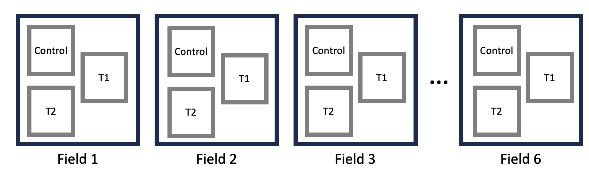
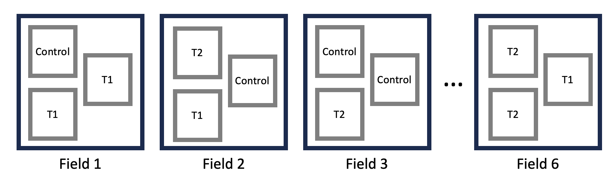
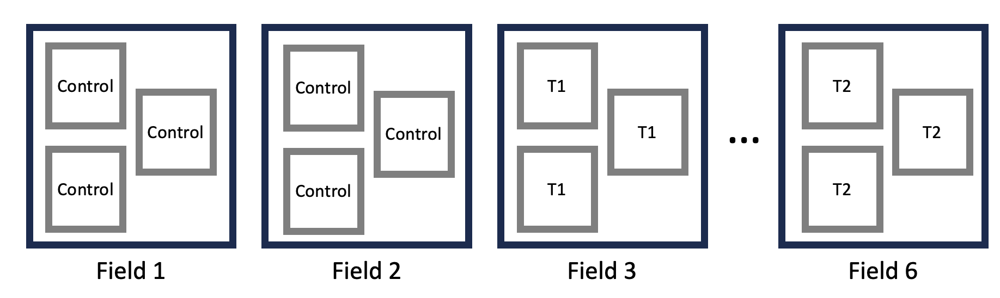
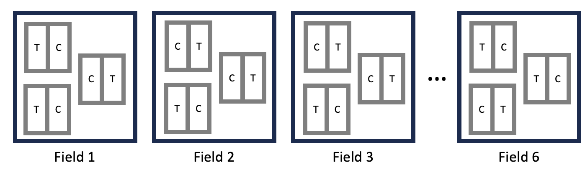
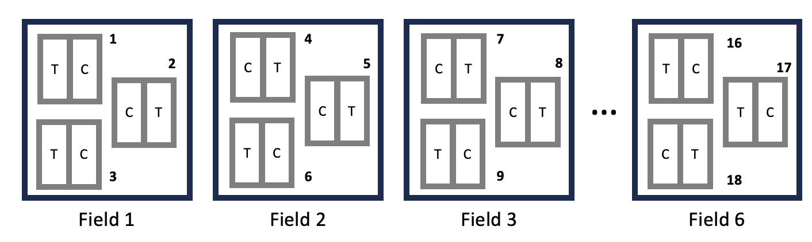
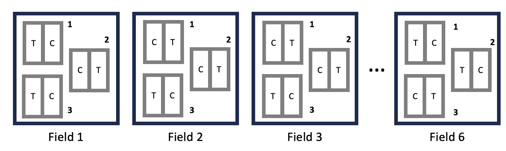

<script type="text/x-mathjax-config">
MathJax.Hub.Register.StartupHook("TeX Jax Ready",function () {
  MathJax.Hub.Insert(MathJax.InputJax.TeX.Definitions.macros,{
    cancel: ["Extension","cancel"],
    bcancel: ["Extension","cancel"],
    xcancel: ["Extension","cancel"],
    cancelto: ["Extension","cancel"]
  });
});
</script>

```{r setup, include=FALSE}

knitr::opts_chunk$set(
	echo = TRUE,
	message = FALSE,
	warning = FALSE,
	cache = TRUE
	)
```

```{r echo=FALSE}

#  NRES 710, Nested Designs
#     University of Nevada, Reno
#     Different applications of nested designs

```

Read **Hurlbert 1984** paper for next class when we discuss Pseudoreplication. It is really long! Cited many many thousands of times. Read from bottom of page 198 ('Pseudoreplication in manipulative experiments') until the end. 

Review Quiz 7

## Experimental Designs

So we have talked about some different experimental designs, and I want to continue on this but by introducing some new ones.

### Randomized Block Designs

One powerful approach to experimental design that we have discussed is using the **Randomized Block Design**. Let's consider an example where we have six fields; within each field we have three plots, and plots are randomly assigned to one of three treatments: control, treatment 1, and treatment 2. Here, we have 6 fields with 3 treatments; technically 18 plots in total.

*Brian draw this on the board: field 1, 2, 3, ... 6.; with three plots within each field*

{width=100%}

**We ensure that every field receives every treatment;** this is a 'fully factorial design'. We randomly decide what the first plot will be treated with in field 1 (e.g., Treatment 1), then with two remaining plots, we randomly determined whether the other two plots will be Control or Treatment 2. This is a randomized block design, and it is very powerful. You don't have to include 'field' in your analysis... but by doing so, it will increase your power. This is something that we want to try for. But, it can be hard to do.

Any questions about this design?

### Completely Randomized Design

Let's talk about another design: a **completely randomized design**. Here, we ignore the blocks (our fields), and instead just randomly assign a treatment to any given plot. We have lumped our blocks together and randomly assign treatments to each plot.

*Brian draw this on the board: fields still have three plots, but (1) they don't necessary have all three treatments, (2) instead each plot is randomly assigned treatment independent of the block, such that (3) some fields have mostly controls, others mostly different treatments*

{width=100%}

We are not ensuring that every field gets every treatment. This results in an **unbalanced design.**

This is a ~fine design, and people use it all the time. In the analysis phase, you can still include 'field' as a random effect.

**Q:** What might be a limitation of this design?

**Q:** What if most of the fields that have 'control' plots are also slightly wetter, while other fields with treatments are slightly dryer?

*Brian draw dry, dry, wet, ..., dry above fields on the board.*

This would introduce **<u>collinearity</u>**! Collinearity makes it difficult to distinguish effects from one another. In this case, it would be difficult to distinguish the effects of individual **fields** from effects of **treatments within the fields**. The **unbalanced design** here introduces collinearity between fixed treatment effects and random field effects.

For example, if **wet fields** have more biomass productivity, then it might make it look like control treatments have more biomass. In this case, the field effect becomes a ***confounding effect***: it has it's own effect, which is collinear with our treatment.

**Q:** If we have 30 fields, is there likely to be a confounding effect due to collinearity? **No.** There could still be collinearity, but if we increase our sample size to be very large, the confounding effects of collinearity will ~disappear -- it will 'wash out' due to the large sample. Field's will still have their own effects, but it becomes less of a confounding effect because the collinearity decreases across the larger, randomized sample. But with only six fields, there's more likely to be confounding effects due to collinearity, because of the small sample size.

**Q:** How did we deal with collinearity before?

- We made sure that all of the X-variables were in the model; we fit different effects to statistically control for one another.
- If we try to do that in the case illustrated on the board, we would we hope to estimate both a field effect and a treatment effect while statistically controlling for eachother.
- However, we might encounter a problem here. Remember that I said that the mixed-effects model were fit using REML... REML involved estimating all the fixed effects first, and then the random effects second. If we have collinearity, it may be unable to give us unbiased betas for fixed effect of treatment, because it has not yet statistically controlled for the effects of field. **It's cannot accounting for the effect of field when estimating those fixed-effect betas**.

**Disclaimer:** I have not yet built a simulation to demonstrate this, like I did for our collinearity lecture a few weeks ago. I might try to do this tomorrow. I'll report back.

**But the point of all this is:** while there are cases where you could analyze this design, doing so has limitations and creates problems. In this case, accounting for the field as a random effect does not necessarily solve the problems we have identified.

In this case, having lots of fields would reduce collinearity. But the best way to fix this problem is to fix it before we start our experiment... and design the experiment with a randomized-block design.

**Questions?**

## Pseudoreplication

Let's say we still have six fields with three plots per field. But let's say we didn't consult with a statistician or your advisor before you planned your experiment... and you designed it like this:

*Brian use six-fields on board but now they have all the controls in one field, treatment 1s in one field, etc.*

{width=100%}

Basically, we randomly determined what each field was going to get, and then each plot got the same treatment within each field.

**Q:** Can anyone see a problem with this design?

In the end, we will have 18 rows in our Excel file, one for each plot. But, is your sample size really 18? **No!** 

This is what we might call '**pseudoreplication**'! Pseudoreplication is...

**Pseudoreplication -- analysis assumes you have more samples than you really do.**

You might be asking yourself: why aren't these three samples different? They have different measures for biomass for each sample...?

The problem is that, let's say the average effect on biomass in the **three plots in Field 1** is really **high**. How do we know whether the biomass is high because of the **control effect** or because of the **field effect**? <u>We don't.</u> And that's why we can't treat them as separate samples.

Easy **rule of thumb** for identifying **pseudoreplication** within samples: your sample is the **largest grouping you can create <u>within a given group/treatment</u>**. Here, the smallest grouping we can make is the plot, and the largest grouping within a given treatment is the field. Because we can group all of these 'samples' together in each field, then our sample is not the 'plot', but rather it is this largest group -- the field.

**Q:** We have 18 'samples', but I actually just said that we only truly have 6 samples. **How can we fix this?** What's an easy way to fix this?

- Take an average! Average of the three plots in each field, and make that be our single 'sample' for each field. In our Excel file, we would replaced the three rows for each field with a single field.
- If we do this, we will have six rows.
- **Q:** If we average the three samples within each plot, can we include field as a random effect with those data? **No, because then we would only have 1 row per field.**
- **This would be a perfectly valid way of analyzing these data that eliminates pseudoreplication.** But there is a better way to do it!

The better way to analyze these data would be to **<u>include a field effect</u>**. This model would look like:

$Biomass = \beta_0 + \beta_1Treatment1 + \beta_2Treatment2 + \epsilon_{field} + \epsilon_{residual}$

When we do this, R (and most stats packages) will **automatically recognize** the pseudoreplication structure in your data, and it will automatically use the **field error** as the residual error when it **calculates the effect of treatment**. In this case, it's not the between-plot error that is your residual error for calculating the effect of treatment. Rather, it is your **between-field error** that is your residual error for **testing the effect of treatment**, because the field is your sample. 

In general, it is the between-sample error that is your residual error for calculating p-values for any fixed-effect. In this case, since we cannot distinguish field effects from treatment effects within each field, our test for treatment effects requires the 'between-field error' as the between-sample error for that test -- not the between-plot error.

## Nested Designs

There is a term for this statistical model, which is the **'Nested Design'**! 

**Nested Design -- e.g., fields are nested within treatments**

In this particular case, the fields are 'nested' within the treatments. An easy way to visualize this is by listing out the treatments (C, T1, T2), the fields, and connecting them with lines:

*Brian draw on fresh board*

```{r nested-design, echo=FALSE, fig.height=2, fig.width=7}
library(ggplot2)

# Data for the plot
nested_data <- data.frame(
  treatment = c("C", "T1", "T2"),
  field = c("F.1", "F.2", "F.3", "F.4", "F.5", "F.6"),
  x_treatment = c(1, 2, 3),  # Spread treatments across x-axis
  x_field = c(0.8, 1.2, 2.2, 2.8, 3.2, 3.8),  # Spread fields across x-axis below treatments
  y_treatment = rep(3, 3),  # Treatments on top (y = 3)
  y_field = rep(1, 6)  # Fields below (y = 1)
)

# Coordinates for plotting lines between treatments and fields
lines_data <- data.frame(
  x = c(1, 1, 2, 2, 3, 3),
  xend = c(0.8, 2.2, 1.2, 3.2, 2.8, 3.8),
  y = c(3, 3, 3, 3, 3, 3),
  yend = rep(1, 6)
)

# Plotting the hierarchy
ggplot() +
  # Plot the treatments at the top
  geom_point(aes(x = nested_data$x_treatment, y = nested_data$y_treatment), size = 4, color = "blue") +
  geom_text(aes(x = nested_data$x_treatment, y = nested_data$y_treatment, label = nested_data$treatment), 
            hjust = 2, size = 5) +  # Slightly move the treatment labels up

  # Plot the fields at the bottom
  geom_point(aes(x = nested_data$x_field, y = nested_data$y_field), size = 4, color = "blue") +
  geom_text(aes(x = nested_data$x_field, y = nested_data$y_field, label = nested_data$field), 
            hjust = 1.2, size = 5) +  # Slightly move the field labels down

  # Draw lines connecting treatments to fields
  geom_segment(data = lines_data, aes(x = x, xend = xend, y = y, yend = yend), size = 1) +

  # Remove axis labels and ticks
  scale_x_continuous(breaks = NULL) +
  scale_y_continuous(breaks = NULL) +

  # Customize labels and appearance
  labs(x = NULL, y = NULL) +
  theme_minimal() +
  theme(axis.text = element_blank(), axis.ticks = element_blank())

```

For a nested design, the hierarchy should always *spread out* from the top down to the bottom.

- The thing that there is more of is nested inside of the thing that there is less of. Fields are nested within treatments.
- It's almost always a random effect that is nested within the fixed effect... although this can get complicated, which we will see next class.

Let's say alternatively, you did this the other way around. You thought the fixed treatment effect was nested within the field effect, it would look like this:

*Brian draw this on the board*

```{r nested-design-2, echo=FALSE, fig.height=2, fig.width=7}
library(ggplot2)

# Data for the plot
nested_data <- data.frame(
  treatment = c("C", "T1", "T2"),
  field = c("F.1", "F.2", "F.3", "F.4", "F.5", "F.6"),
  x_treatment = c(1, 2, 3),  # Spread treatments across x-axis
  x_field = c(0.8, 1.2, 2.2, 2.8, 3.2, 3.8),  # Spread fields across x-axis above treatments
  y_treatment = rep(1, 3),  # Treatments below (y = 1)
  y_field = rep(3, 6)  # Fields above (y = 3)
)

# Coordinates for plotting lines between fields and treatments
lines_data <- data.frame(
  x = c(0.8, 1.2, 2.2, 2.8, 3.2, 3.8),
  xend = c(1, 1, 2, 2, 3, 3),
  y = rep(3, 6),
  yend = rep(1, 6)
)

# Plotting the hierarchy
ggplot() +
  # Plot the fields at the top
  geom_point(aes(x = nested_data$x_field, y = nested_data$y_field), size = 4, color = "blue") +
  geom_text(aes(x = nested_data$x_field, y = nested_data$y_field, label = nested_data$field), 
            hjust = 1, size = 5) +  # Slightly move the field labels up

  # Plot the treatments at the bottom
  geom_point(aes(x = nested_data$x_treatment, y = nested_data$y_treatment), size = 4, color = "blue") +
  geom_text(aes(x = nested_data$x_treatment, y = nested_data$y_treatment, label = nested_data$treatment), 
            hjust = 2, size = 5) +  # Slightly move the treatment labels down

  # Draw lines connecting fields to treatments
  geom_segment(data = lines_data, aes(x = x, xend = xend, y = y, yend = yend), size = 1) +

  # Remove axis labels and ticks
  scale_x_continuous(breaks = NULL) +
  scale_y_continuous(breaks = NULL) +

  # Customize labels and appearance
  labs(x = NULL, y = NULL) +
  theme_minimal() +
  theme(axis.text = element_blank(), axis.ticks = element_blank())

```

This doesn't work because it <u>spreads out upward</u>. This doesn't work, so we have set this up incorrectly.

### R handles this for us

One cool thing is that you don't necessarily need to recognize that there is nesting structure in your data -- you just have to include that field effect! Just like with collinearity and swamping, you don't have to recognize these features, you just have to include all of the X-effects. Same thing with pseudoreplication -- you don't have to recognize it, you just have to include all of the appropriate random variables.

But, it is important to understand what **<u>pseudoreplication is</u>** and **<u>how it exists</u>**. When we have a nested design, we automatically get pseudoreplication. **<u>Nesting happens when some random samples only get certain fixed effects</u>**. Some fields only get controls, some only get treatment 2, etc. That's the nesting.

Notice that nesting and collinearity are not quite the same.

- For the **completely randomized unbalanced design**, this was not nesting, because each field did get more than one treatment in most examples.
- Nesting is essentially **'perfect collinearity'** -- each field only got a certain type of treatment.

The most simple design -- one plot per field -- is also like ~nesting. But, there's no pseudoreplication, we don't have more than one sample per field, so we can't include a field effect, and therefore we don't have to worry about trying to distinguish between the field effect and the treatment effect, because we only have 1 treatment per field.

## Example in R

For today's dataset, we have six fields, each field has three plots, each plot received the same treatment within each field. You can examine how the data were simulated in the code for 'Truth'. **Truth** is:

- $\beta_0 = 20$
- $\beta_1(T1) = 10$
- $\beta_2(T2) = 20$
- $\sigma_{field} = 4$
- $\sigma_{residual} = 1$

Let's examine the data:

```{r fig.height=4, fig.width=5}
### Nested design analysis in R

# Read the data
datum <- read.csv("lecture_18_dataset1.csv")

# Examine it
head(datum, 10)

# Make 'Treatment' a factor
datum$Treatment <- as.factor(datum$Treatment)

# Plot it
plot(Biomass ~ Treatment, data = datum)

```

Let's look at a simple 'lm()' first:

```{r fig.height=4, fig.width=5}
# Simple linear model
results <- lm(Biomass ~ Treatment, data = datum)
summary(results)

```

We get good estimates of effects that include Truth within their uncertainty. But we have pseudoreplicated here! The summary output says that we have 15 degrees of freedom, which tells us that the analysis is using all 18 samples to calculate p-value using our residual error. Our p-values are incorrect, they are smaller than they should be, because we have assumed we have more samples than we really do. 

If we include a random effect of field, we can estimate this all using just the 6 samples, our fields:

```{r fig.height=4, fig.width=5}
# Linear mixed-effects model
library(nlme)
results2 <- lme(Biomass ~ Treatment, data = datum, random = ~1|Field)
summary(results2)

```

When we examine the summary output, one thing that's noteworth is that it gives us a 'Degrees of Freedom' column that we have not seen before. This is because when you run an LME(), <u>it's looking for these nested designs</u>. R goes in and asks 'do you have nesting in your data?', and if it detects it, R attempts to use the appropriate random deviation structure as the error for each term. 

Look at the bottom:

- Number of observations: 18
- Number of groups: 6

More importantly, in looking at the effect of treatment, the degrees of freedom has decreased from 15 in the LM() down to 3 (!) in the LME().

'Degrees of freedom' is an estimate of our sample size minus the number of comparisons we are exploring. So in this case, we have 6 samples (our fields) and three treatment groups (control, T1, T2), so: 6 - 3 = 3 DF.

The p-values are much larger. Previously, they were e-12 and e-16, now they are e-4 and e-4. We lost a lot of power. But that's the way it should be! **<u>We don't have 18 samples to test for the effects of treatment; we only have 6</u>.**

The cool thing is that we don't have to tell R that we have pseudoreplication or nesting. We just provide the random effect of field, and **<u>R fixes the estimation automatically.</u>**

Make sure you check your degrees of freedom to make sure everything lines up. The degrees of freedom needs to be *less* than the number of **samples** you have. If it's larger than the number of samples, something isn't right.

## Another nesting example

Nesting doesn't always generate pseudoreplication, but it is important for us to understand nesting for other reasons as well.

In this case, we have 6 fields, 3 plots in each field, and each plot is sub-divided and sub-plots are randomly assigned to 'control' or 'treatment'.

*Brian draw this on the board*

{width=100%}

**Q:** What kind of design is this? **Randomized block design**. We have plots that are 'blocked', where we randomly assign treatments within; all treatments are assigned within each block. (Also called a **'split-plot design'**.)

**Q:** When you run this analysis, what will your block be? Is it a field, or a plot?

In truth, we really are most interested in the **plots**. And we could run this model:

$Y = \beta_0 + \beta_1Treatment + \epsilon_{plot} + \epsilon_{residual}$

We want to include the error term due to plot because: plots can be different from each other. Some plots might be wet, others might be dry. Some might get more sun, other less. Etc. There might be variation among plots, and we want to account for that. Our plots are our blocks; within each block, we have a random assignment of treatments. 

But you might say: but what if this whole field is wet? Or what if this whole field has rich soils?

In truth, **plots are nested within fields**. These three plots are only in field 1. These three plots are only in field 2. Etc.

Do we also need to account for error due to field? ***It depends!*** It depends how you identified different plots numerically.

If we identified each plot in our dataset with 1, 2, 3, ... 18, like this:

{width=100%}

Then all we have to do is include an $\epsilon_{plot}$. This model works pretty well! But it cannot partition the error due to field from the error due to plots.

But sometimes people identify the plots differently:

{width=100%}

Within each field, the three plots are numbered 1, 2, and 3. This can be problematic!

The problem here is that when we tell R to estimate an <u>error due to plot</u>, what's it going to assume? It will group all of the 1s together, and all of the 2's together, etc. It will thing all of the 1 samples came from the same plot -- but they aren't. In truth, this is plot 1 in field 1, plot 1 in field 2, plot 1 in field 3, etc. In this case, we **have to communicate this to R**, we have to tell R to identify the additional nested structure of our data: fields > plots > treatments.

Plots are nested within fields. We can communicate this with:

$Y = \beta_0 + \beta_1Treatment + \epsilon_{field|plot} + \epsilon_{residual}$

This is telling R that we have random error due to fields, and then within fields, there is also random error due to plots. *Plots are nested within fields*. R annotates this as with 'field | plot', so we can annotate it similarly.

Let's look at some data I have created:

```{r fig.height=4, fig.width=5}
### Another example analysis in R
# Read the data
datum <- read.csv("lecture_18_dataset2.csv")

# Examine it
head(datum, 15)

# Structure
str(datum)

# Plot it
plot(Biomass ~ Treatment, data = datum)

```

Now, I am going to have to analyze this in a specific way -- because of the way I have numbered my plots. I have numbered the plots 1-3 within each field. The plots numbered 1 in the first field are not the same as the plots numbered 1 in the second, third, fourth, etc. fields. I need to tell R that, and specify that plots are nested within fields to correctly partition the variance.

```{r fig.height=4, fig.width=5}
# Linear mixed-effects model: incorrect random-effect structure for this design
results <- lme(Biomass ~ Treatment, data = datum, random = ~1|Plot)
summary(results)
# This says: only 3 groups (plots). But we had more! This is not specified correctly; this is assuming a different structure than we really have.

```

Look at the analysis results. It says there are only '3 groups' -- or 3 plots! We have many more plots than this.

For treatment, it says we have 140 degrees of freedom. This is fine! We have 144 observations, and it's using every single one of these observations when calculating the effect of treatment. This is fine because we have a paired, treatment and control blocking design with no pseudoreplication. So this is working well.

But it's not giving us a good estimate of plot. It is saying there are only three plots with many replicates within each plot. This causes us to lose power, because some of the variation due to plot is not accurately being recorded and partitioned. The true residual variation was 1, but it's saying it's 2.15.

What if we run it using the 'PlotOrder' variable, that numbers plots among all the fields as 1, 2, 3, 4, 5, ... up to 72? This has no information about 'Field.

```{r fig.height=4, fig.width=5}
# Linear mixed-effects model: okay, but non-ideal random-effect structure for this design
results2 <- lme(Biomass ~ Treatment, data = datum, random = ~1|PlotOrder)
summary(results2)
# This says: only 72 groups (1 for each plot). This is correct! But it fails to measure partition random error due to field. 

```

To get this model correct, we need to run it like this:

```{r fig.height=4, fig.width=5}
# Linear mixed-effects model: most correct random-effect structure with plots nested within fields
results3 <- lme(Biomass ~ Treatment, data = datum, random = ~1|Field/Plot)
summary(results3)

```

"Random = tidle 1 | with plots nested within field". We need to tell R that plots are nested within fields.

Now things are different! At the bottom, we now see that we have 144 observations, 24 fields, and *72 plots %in% fields*! So it is now correctly recognizing that we have 72 plots now. 

We only have 71 degrees of freedom, as we have lost degrees of freedom due to the large number of plots. But that's okay.

Now our residual variation is good: it's now ~1, the 'plot in field' error is ~2, and the field error is 0.44. The field error is a little low (truth was 1), but this is likely due to random chance.

- Note: from time to time, random variation in the data causes our estimates to be different from Truth. What do we call this? Type I error! <u>I simulated the data again with a different seed, and then it correctly estimated the variances to field, plot in field, and residual.</u>

Most importantly, look what happened to our power. The larger the t-value, the more power we have. Before, our t-value for the treatment effect was 27. Now it is 57! We have ~doubled our power.

**Questions?**

<br>

## Truth

Here is the code to create Truth for the two datasets analyzed here today.

```{r}
################### 'Truth' #################### 
### Lecture 18: code to simulate data for class

### Dataset 1
# Simulate nested-design data
set.seed(123)

# Fields
n_fields <- 6
n_samples <- 3
Field <- sort(rep(1:n_fields, n_samples))

# Treatment
Treatment <- c(rep("Control", n_samples*2), rep("T1", n_samples*2), rep("T2", n_samples*2))

# Dummy-code treatment
dummy <- data.frame(model.matrix(~ Treatment - 1))
colnames(dummy) <- c("Control", "T1", "T2")

# Field error
FieldError <- rep(rnorm(n_fields, 0, 0.5), each = n_samples)

# Error within fields (residual error)
Error <- rnorm(n_samples*n_fields, 0, 1)

# Response variable -- biomass
Biomass <- 20 + 10*dummy$T1 + 20*dummy$T2 + FieldError + Error

# Save the data
datum <- data.frame(Field = Field, Treatment = Treatment, Control = dummy$Control, T1 = dummy$T1, T2 = dummy$T2, FieldError = FieldError, Error = Error, Biomass = Biomass)

# Save the data
write.csv(datum, "lecture_18_dataset1.csv", row.names = FALSE)


### Dataset 2
# Simulate nested-design data
set.seed(123)

# Fields
n_fields <- 24
n_plots <- 3
n_treatments <- 2
Field <- sort(rep(rep(1:n_fields, n_plots), n_treatments))

# Plots
Plot <- rep(c(rep(1, n_treatments), rep(2, n_treatments), rep(3, n_treatments)), n_fields)

# Treatments
Treatment <- rep(rep(c(0, 1), n_plots), n_fields)

# Field error
FieldError <- rep(rnorm(n_fields, 0, 1), each = n_plots * n_treatments)

# Plot error
PlotError <- rep(rnorm(n_plots * n_fields, 0, 2), each = n_treatments)

# Residual error
Error <- rnorm(length(Field), 0, 1)

# Response variable -- biomass
Biomass <- 20 + 10*Treatment + FieldError + PlotError + Error

# Plot order: plots numbered from 1 to 72
PlotOrder <- rep(1:(n_fields*n_plots), each = n_treatments)

# Save the data
datum <- data.frame(Field = Field, Plot = Plot, PlotOrder = PlotOrder, Treatment = Treatment, FieldError = FieldError, Error = Error, Biomass = Biomass)

# Save the data
write.csv(datum, "lecture_18_dataset2.csv", row.names = FALSE)


```

[--go to next lecture--](lecture_19.html)
