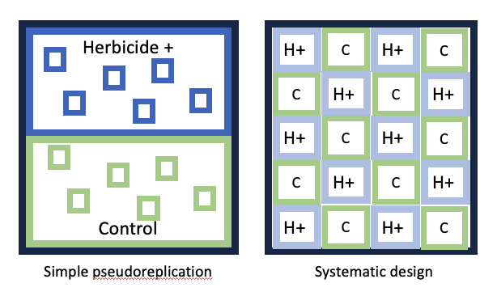

```{r setup, include=FALSE}

knitr::opts_chunk$set(
	echo = TRUE,
	message = FALSE,
	warning = FALSE,
	cache = TRUE
	)
```

```{r echo=FALSE}

#  NRES 710, Pseudoreplication
#     University of Nevada, Reno
#     Discussion of Hurlbert 1984

```

So I asked you all to read Hurlbert 1984, a classic paper in ecology and experimental design. This paper has been cited >10,000 times. I read it in all of my graduate school statistics class, and I believe it remains necessary to introduce you all to this paper and concept further in this class as well.

Let's start with where I told you all to start on page 198 at the 'Pseudoreplication in Manipulative Experiments'

## Four Types of Pseudoreplication

### Simple pseudoreplication

The first type of pseudoreplication discussed by Hurlbert was '**simple pseudoreplication**'.

To illustrate this, Hurlbert discussed an example where a field was split in half into two large sub-fields, and the experimenters wanted to test if there was an effect of herbicide on beetle density.

*Brian draw one large square field; split it into half, treatment and control; indicate pseudoreplicate samples within each subfield*

{width=80%}

These 'replicates' within each subfield are **not true replicates**, because the *treatment is being applied to the entire subfield*.

The problem is that: (1) two sub-fields will always be different from eachother. Any two points in space in the universe are different from eachother, and if we collect enough data a test will say those two points are statistically different. (2) If we do this 'experiment', we don't know whether the results are significant due to experimental treatment OR the two subfields simply being different from eachother.

Two features of 'simple pseudoreplication':

- **What is the treatment being applied two?** Entire fields
- **Treatment is only being applied to two replicates**: one sample is treated, one sample controlled.

**Sometimes we have to do this.** If we want to perform a large-scale manipulative experiment of feral pig density, for example, we may be constrained by only two locations where we can (1) reduce pig density, or (2) leave pigs unmanaged. In this case, we know that we cannot do statistics comparing response variables between managed and unmanaged areas. And this is what Hurlbert recommends at the end: if you commit this 'simple pseudoreplication', be honest about the limitations of your design and communicate the results clearly.

This is still common. One student I spoke to this year had a design that was identical to this. They were constrained by the biological system they were studying with large animals that are difficult to manipulate.

<!-- **Simple pseudoreplication vastly limits the scope of inference.** In the pig example, we **cannot say** there is an effect of pig management on seedling density. We can only say that seedling density was greater in an area where pigs were managed compared to an area where pigs were not managed. -->

### Sacrificial Pseudoreplication

This is a weird name! I'm not sure I understand it. But...

Let's say we now have four fields for the beetle experiment!

*Brian draw two more replicates on the board: two herbicide fields next to each other, two control fields next to each other*

In this case, we truly do have replicates... We have multiple fields: two treatments, two controls.

If we were to use each of these individual measurements as true replicates, we would commit 'sacrificial pseudoreplication'. We would be saying that we have a sample size of 20, but really we have a sample size of 4. 

The good news is... This is what we have talked about in class so far! To handle this is pretty easy: we can include a **random-effect blocking variable** so that our sample size for the effect of herbicide is measured by the number of fields.

Two features of 'sacrificial pseudoreplication':

- More than 1 replicate per treatment
- **can be fixed!**

Term is confusing... maybe call it '**spatial pseudoreplication**'?

### Temporal Pseudoreplication

This is like a design we talked about last Tuesday, where we might give a drug to 5 individuals and placebo to 5 individuals, and we measured the effects of those drug at 0 hours, 2 hours, 4 hours, 6 hours, and 8 hours.

Since we measured their response at five time points, we have 25 sample measurements instead of just 5 sample measurements for each group.

```{r scatter-plot-base, echo=FALSE, message=FALSE, warning=FALSE, fig.height=4, fig.width=6}
# Simulate data
set.seed(123)
n <- 5 # Number of individuals per group
data <- expand.grid(
  ID = 1:n,
  Time = factor(c(0, 2, 4, 8), levels = c(0, 2, 4, 8)), # Categorical Time
  Drug = c("Placebo", "Drug")
)

# Pain values based on the description
data$Pain <- with(data, ifelse(
  Drug == "Placebo",
  ifelse(Time == 0, 10, ifelse(Time == 8, 10, 10)),
  ifelse(Time == 0, 10, ifelse(Time == 8, 10, 10 - as.numeric(as.character(Time))))
))

# Add some individual variability (noise)
data$Pain <- data$Pain + rnorm(nrow(data), mean = 0, sd = 1)

# Base R plot
# Base R plot with adjusted x-axis limits
par(mar = c(4,4,0,0))
plot(
  NA, 
  xlim = c(0.5, 4.5), # Adjust limits to avoid excessive space
  ylim = range(data$Pain), 
  xaxt = "n", 
  xlab = "Time (hours)", 
  ylab = "Pain level"
)
axis(1, at = 1:4, labels = c("0", "2", "4", "8"))

# Add points for each group
colors <- c("Placebo" = "blue", "Drug" = "red")
for (drug in levels(data$Drug)) {
  points(
    as.numeric(data$Time[data$Drug == drug]),
    data$Pain[data$Drug == drug],
    col = colors[drug], pch = 16
  )
}

# Add lines connecting means for each group
for (drug in levels(data$Drug)) {
  means <- tapply(data$Pain[data$Drug == drug], data$Time[data$Drug == drug], mean)
  lines(
    1:4, means, col = colors[drug], lwd = 2
  )
}

# Add legend
legend(
  "bottomright", legend = levels(data$Drug), 
  col = colors, pch = 16, lwd = 2, bty = "n"
)

```

Let's say we wanted to test for the effect the drug -- and not consider the effect of time. If we used all 25 samples for each group, we would be committing temporal pseudoreplication. We would be artificially inflating our sample size with observations made at different time periods -- but the test would assume that all of the observations were made at the same time period, when they were not.

To test for the effects of drug at time 0, our sample size is the number of individuals measured at time zero.

**Thought:** Most examples of pseudoreplication are going to either be spatial or temporal pseudoreplication. Simple pseudoreplication is basically a restricted version of spatial pseudoreplication.

**Q:** What would you call this?

*Brian erase all of the data except two individuals measured through time*

```{r scatter-plot-base-sub, echo=FALSE, message=FALSE, warning=FALSE, fig.height=4, fig.width=6}
# Simulate data
set.seed(123)
n <- 1 # Number of individuals per group
data <- expand.grid(
  ID = 1:n,
  Time = factor(c(0, 2, 4, 8), levels = c(0, 2, 4, 8)), # Categorical Time
  Drug = c("Placebo", "Drug")
)

# Pain values based on the description
data$Pain <- with(data, ifelse(
  Drug == "Placebo",
  ifelse(Time == 0, 10, ifelse(Time == 8, 10, 10)),
  ifelse(Time == 0, 10, ifelse(Time == 8, 10, 10 - as.numeric(as.character(Time))))
))

# Add some individual variability (noise)
data$Pain <- data$Pain + rnorm(nrow(data), mean = 0, sd = 1)

# Force the pain observations to be different, known values
# with two clearly different trajectories
data$Pain <- c(12, 12.5, 12.25, 12.4, 8.5, 9, 8.25, 8.4)

# Base R plot
# Base R plot with adjusted x-axis limits
par(mar = c(4,4,0,0))
plot(
  NA, 
  xlim = c(0.5, 4.5), # Adjust limits to avoid excessive space
  ylim = range(0, data$Pain), 
  xaxt = "n", 
  xlab = "Time (hours)", 
  ylab = "Pain level"
)
axis(1, at = 1:4, labels = c("0", "2", "4", "8"))

# Add points for each group
colors <- c("Placebo" = "blue", "Drug" = "red")
for (drug in levels(data$Drug)) {
  points(
    as.numeric(data$Time[data$Drug == drug]),
    data$Pain[data$Drug == drug],
    col = colors[drug], pch = 16
  )
}

# Add lines connecting means for each group
for (drug in levels(data$Drug)) {
  means <- tapply(data$Pain[data$Drug == drug], data$Time[data$Drug == drug], mean)
  lines(
    1:4, means, col = colors[drug], lwd = 2
  )
}

# Add legend
legend(
  "bottomright", legend = levels(data$Drug), 
  col = colors, pch = 16, lwd = 2, bty = "n"
)

```

This is another example of **simple pseudoreplication** where the pseudoreplication happens through time.

### Implicit Pseudoreplication

This last one is... **nefarious**! I say 'nefarious', because... you *know* you pseudoreplicated your data, but you try to weasel out of it some other way.

To illustrate **implicit pseudoreplication**, let's reconsider the simple pseudoreplication example: herbicide area and control area, both with spatial pseudoreplicates within each treatment area.

*Brian illustrate this on the board again, if necessary*

We submit this for publication, but a reviewer says to us: this is pseudoreplication, you are exaggerating your sample size, you can't do this. **What are we going to do now?**

One alternative that might tempt you... could be to no longer report a p-value. Instead, you would just report **betas** and **confidence intervals**. And if the confidence intervals do not include zero, then you might say: 'there is a difference between herbicide and control!'

This one's a bit nefarious, because you are not being honest. As I've mentioned previously, p-values and confidence intervals are measured the same way: they both use the same measures of variation for their calculations. That's why whenever your p-value = 0.05, one of the confidence intervals will be zero.

So if you can't use all of these pseudoreplicates to calculate the variation for your p-value, you **also cannot use them to calculate the variation for your confidence intervals**.

You would have committed 'inferential pseudoreplication' because you didn't calculate a p-value and instead used 95% CI to infer statistical significance from those confidence intervals.

You may run into this problem at some point in your career. Maybe your studying a process at the watershed level, and watersheds are really big. It's hard to replicate across water sheds. Or it's hard to remove predators across entire landscape-scale. And that's okay. **When faced with some form of simple pseudoreplication, and wanting to avoid inferential pseudoreplication... what can you do?**

<u>Remember: you don't always have to have statistics.</u> Statistics are meant to strengthen our science and validate our hypotheses. **But you dont *have* to do statistics**. For a really great experiment, you may not have to do statistics: instead, you could just show a bar-chart, that could show the pattern!

When we commit **simple pseudoreplication**, we cannot perform calculate 95% CI or p-values. In the pig example, we **cannot say** there is an effect of pig management on seedling density. We can only say that average seedling density was 100 seedlings/ha where pigs were removed and 10 seedlings/ha where pigs were unmanaged. We can't say whether they are statistically different or not because of the limitations of our statistical design, but it sure seems like they are different. And sometimes that's the best you can do, and it's fine.

An example of someone doing this and getting it published: **Krebs (1995) Impact of Food and Predation on the Snowshoe Hare Cycle. *Science* 269(5227) [link](../papers/krebs1995.pdf).**

- **Experiment**: researchers hypothesized that neither predators nor food but BOTH that influenced hares. An interaction between predators and food influenced hares.
- Monitored hare density in two **control plots** for 15 years.
- Monitored hare density in two **food-supplemented** plots.
- Monitored hare density in two plots where they **removed predators** and put up fences.
- **Interaction**: only had a single plot where they removed predators and supplemented food. Removed predators and then put up an electric fence; full-time technicians that kept repairing the fence from moose; kept raptors out with monofilament line.
- No replication of the interaction plot. it was $1 km^2$ in area! Huge undertaking.
- **Results**: prevented the snowshoe hare cycle from occurring in the interaction plot. At the end of the 10-year study, density got really high to a point of carrying capacity, and rabbits then started leaving the plot.
- No replication for the interaction plot! But published in *Science* 

**So, my advice is:** don't figure out some sneaky way to go-around your pseudoreplication. Put your cards on the table and just be honest about your design.

- "Here's what we did and why we couldn't do more. We couldn't replicate across watersheds or landscapes. But here's what we found:"
-  Report summary statistics from across the areas and leave it at that.

## Inference Limitations

To introduce the term 'pseudoreplication' (p. 190), Hurlbert describes an example where you might want to understand how leaf decomposition rate varies by water isoclines in a lake. He discusses putting out 8 leaf-litter bags at one spot along the 1-m isocline and 8 at one spot along the 10-m isocline. He makes the argument basically that this is a statistical test of these data is 'simple pseudoreplication' and would only support the idea that two locations are different from eachother -- independent of the isocline treatment. He argues that our **inference is limited** to comparing those two points, not the treatment effect.

I think it's important to point out that this design is okay, as long as we are being honest about the scope of our inference! We are comparing decomposition rates in one area to another. That's fine.

He says a much superior design would be to spread the samples around the lake, perhaps pairing the isocline samples (1m, 10m) and 8 different locations around the lake. This would better capture variation in decomposition rates around the isoclines of the lake; much better than if they were lumped in one spot. 

**Q:** But, are there still limits to our inference here? **There's still only one lake!**

OK, well, we were working in Boca Reservoir. But now let's say we do this at 5 lakes around Truckee: Boca, Stampede, Independence, and two others. **Well, now our inference is limited to the decompositions rates near Truckee, CA.** Then we could expand to all of California -- and then our inference would be limited to California.

Ultimately, there is always a limit. We could randomly sample lakes all around the Earth, put leaf-litter bags at 1-m and 10-m isoclines... and then we are still limited to making conclusions about lakes on Earth! Right?

Except... what if these results we find are because I, Brian Folt, conducted the experiment. **How do we know if someone else conducted the experiment would get different results?**

**My point with all of this is that:** no matter how well we design our studies, there are always **limits to our inference**. <u>These limits are not necessarily 'pseudoreplication', per se.</u>

## When Is It Pseudoreplication?

We have spent a week on this, but it still not may be also easy to identify when it is **pseudoreplication**. So I have tried to put together a list to help us identify when it is pseudoreplication and when it may not be.

### Two Rivers Example

Let's say we have two rivers: the **Truckee River** and the **Carson River**.

*Brian draw two rivers on the board with 6 samples from each river*

Let's say we measure fish density in the Truckee River in six spots, and we do that in the Carson River as well. We then do a **T-test** to determine if fish density is greater in the Truckee River compared to the Carson River on average.

**Q:** Have we committed pseudoreplication?

**NO!** We have identified our samples as being from these two different rivers. We want to know if the Truckee and Carson are different from eachother. These are true measurements of the Truckee River and also the Carson River.

***But***, let's now say we have identified the Truckee as a **'clean river'**, whereas the Carson we say is **'disturbed river'**. (There is a super-fund site due to mercury pollution from gold mining activities, I think.)

**Q:** If we take our samples from the Truckee and the Carson and use them to test whether clean rivers have different fish density than polluted rivers, is that pseudoreplication? **Yes.** Because we only have one clean river and one polluted river. We have committed simple pseudoreplication.

<u>See how easy it is to move from not-pseudoreplicating to pseudoreplicating?</u>

Ultimately it has to do with the question of: **Are you comparing *characters* or *characteristics*?**

Characters are individuals. In this case, we have true measurements from each ***individual river***, and can make valid inferences comparing the two individual rivers. But when we compare ***characteristics*** of the rivers, that apply to the whole river... and <u>that river is just one sample of the greater population of rivers with that characteristic</u>.

### Ways to Identify Pseudoreplication

#### 1) **What is the largest way you can 'clump' your samples?** That 'clump', that 'group', is your sample size; each grouping is a true replicate.

- E.g., all of our lake-fed samples can be clumped into a river, so the river is our replicate.
- E.g., what if instead of water type, we were interested in the effects of velocity on fish density?
- *Brian erase water type and instead label each sample with different velocity measurements; e.g., 20 CFS, 6 CFS, 32 CFS)*
- In this case, we can't clump these samples together, our X-variable is mixed between rivers. Now, each sample is a true replicate for examining the effect of water velocity on fish density.
   
#### 2. **Look at your data spreadsheet: is there info repeated over-and-over again?**

- E.g., remember our 'size x age' experiment: Size, Age, Sex, Individual

```{r, echo=FALSE}
# Create the data frame
data <- data.frame(
  Individual = c(1, 1, 1, 1, 1, 2),
  Age = c(1, 2, 3, 4, 5, 1),
  Size = c(0.5, 0.9, 1.2, 1.4, 1.5, 0.7),
  Sex = c("F", "F", "F", "F", "F", "M")
)

# Display the table
knitr::kable(data)
```

- So for individual one, we made measurements each year for **five years**...
- The individual got **bigger** with each measurement...
- We knew it was a female in year 1. For year 2, do we need to look back at our datasheet? Nope! Once a female, always a female.
- **Sex gets repeated over-and-over for individuals.** This means that each **individual** is only **one true replicate** for the effect of 'sex'. Treating multiple observations of individuals as multiple replicates for the sex effect would be <u>pseudoreplicating.</u>
- We don't have to worry about pseudoreplication for the effect of age on size. The numbers are all different, because the variable changes.

#### 3. **What is your treatment applied to?**

- E.g., you're applying a **drug** to an **individual**; the individual is the replicate for the effect of drug.
- E.g., you're treating a sagebrush plot with an herbicide to kill non-native grasses; the **plot** is the **replicate** for the effect of **herbicide**.
- There are X-attributes that can change in your plots; and different observations in the plot might be true replicates for effects of those other attributes.
- But the herbicide is treated across the whole plot-level, and once it's treated it cannot change. Plot is the replicate for herbicide.

**Questions?**

I hope I have opened your eyes to this. Keep an eye out for pseudoreplication in your study designs, the work you engage your colleagues on, and the studies that you read!

[--go to next lecture--](lecture_21.html)
